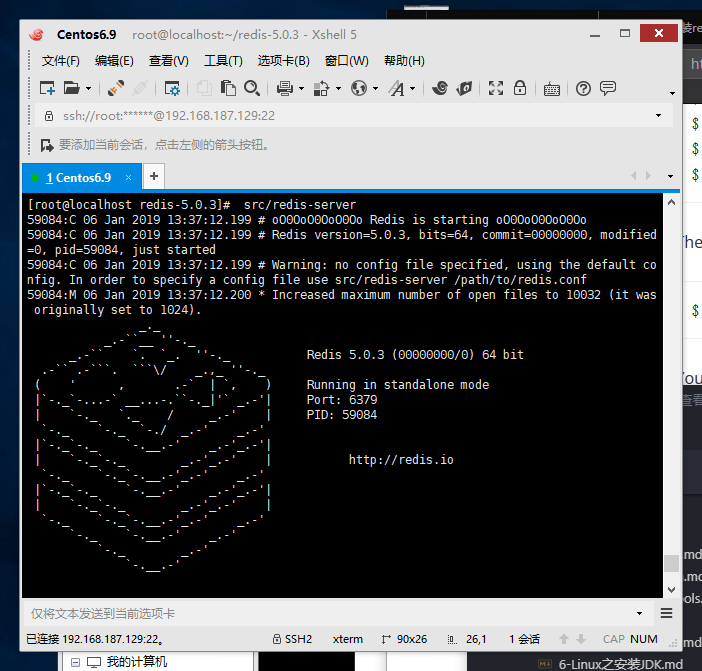

总操作流程：
- 1、[安装编译环境](#Linux-01)
- 2、[下载安装redis](#Linux-02)
- 3、[配置](#Linux-03)
- 4、[测试](#Linux-04)

***

# <a name="Linux-01" href="#" >安装编译环境</a>

```
yum -y install gcc-c++
```

# <a name="Linux-02" href="#" >下载安装redis</a>
```
 wget http://download.redis.io/releases/redis-5.0.3.tar.gz

 tar xzf redis-5.0.3.tar.gz

 cd redis-5.0.3

 make

 ```

# <a name="Linux-03" href="#" >配置</a>

``` 
make PREFIX=/usr/local/redis install  #指定安装路径

cp redis.conf /usr/local/redis

cd ..

rm -rf redis-* #删除多余的文件

cd /usr/local/redis

vim redis.conf
```

>daemonize yes (no -> yes)


# <a name="Linux-04" href="#" >测试</a>
- 1、redis 的启动 
 ```
 cd /usr/local/redis/bin

 ./redis-server

 ```
>成功标志



> 按ctrl + C 可退出redis 启动窗口(使用xshell快捷键：ctrl +shift+ C )

- 2、redis 的关闭

> 命令查看

```
cd ~

ps aux | grep redis
```

> 关闭
```
kill -9 8088
```

- 3、另外一种方式启动

```
 cd /usr/local/redis/
 
 ./bin/redis-server ./redis.conf
```