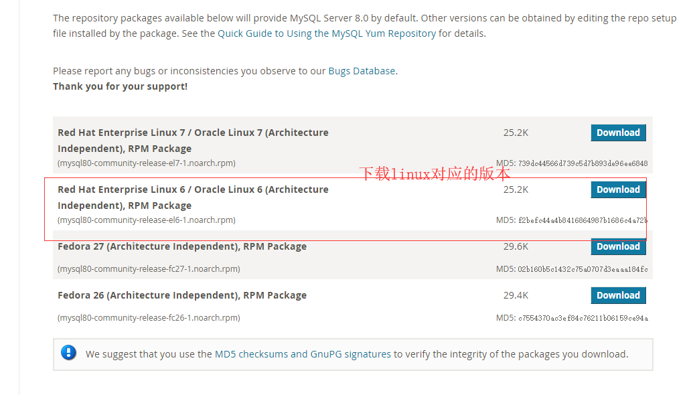
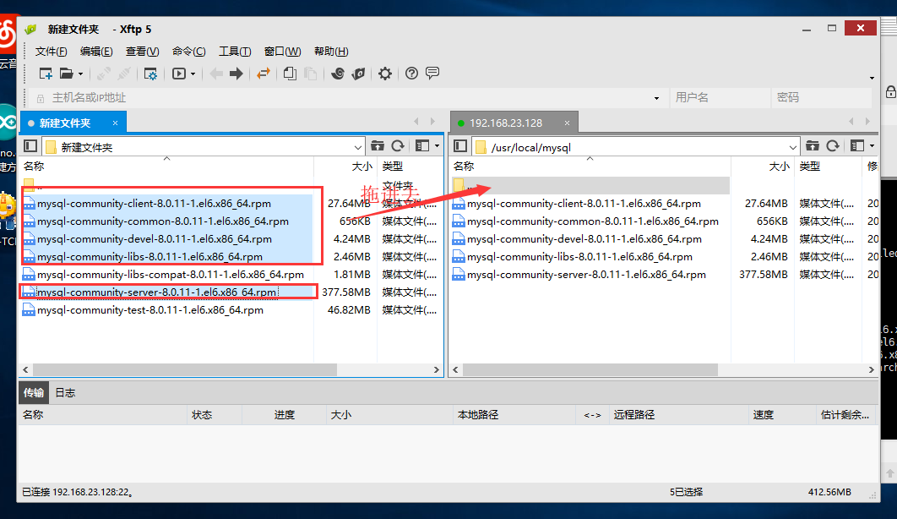

[参考文献](https://dev.mysql.com/doc/mysql-repo-excerpt/5.6/en/linux-installation-yum-repo.html)

总操作流程：
- 1、删除系统自带的mysql；
- 2、下载安装mysql；
- 3、修改mysql密码；

----------

# 删除系统自带的mysql
```
rpm -qa mysql #看是否安装过mysql

rpm -qa | grep mysql | xargs rpm -e --nodeps 文件名 #卸载mysql
```
# 下载安装mysql(CentOS 6)
### 1、下载
[下载地址](https://dev.mysql.com/downloads/repo/yum/)
```
uname -r #查看系统版本
```

### 2、上传
```
su #切换到root，输入密码进入

chmod  0777 /usr/local #给目录写入权限

```

### 3、安装
`我的版本是：CentOS 6`
`安装顺序：common --> libs --> clients --> server`
```
ls 

#安装发行包
yum localinstall mysql80-community-release-el6-1.noarch.rpm

#检查MySQL Yum存储库是否已成功添加
yum repolist enabled | grep "mysql.*-community.*" 

#安装MySQL
yum install mysql-community-common
yum install mysql-community-libs
yum install mysql-community-client
yum install mysql-community-server

service mysqld start #启动MySQL服务器

service mysqld status #检查MySQL服务器的状态

```
# 修改mysql密码
```
grep 'temporary password' /var/log/mysqld.log # 获取临时密码

mysql -u root -p # 使用临时密码登录

#修改root账户的密码，密码：MyNewPass4!
mysql > ALTER USER 'root'@'localhost' IDENTIFIED BY 'MyNewPass4!';
mysql > flush privileges;
mysql > quit;

service mysqld restart #重启mysql
````
