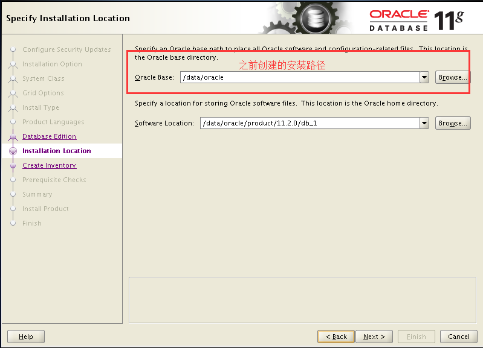
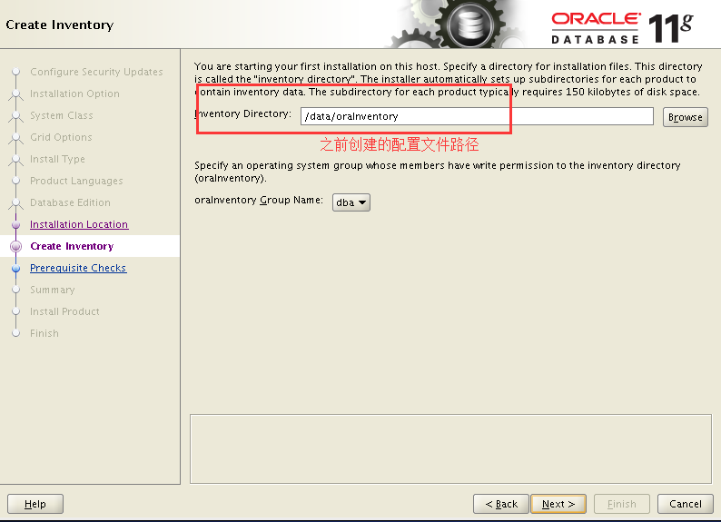

[参考文献](https://www.cnblogs.com/muhehe/p/7816808.html)

操作总流程：
- 1、安装的硬件要求；
- 2、安装Oracle前的准备；
- 3、下载安装；
- 4、测试。

***
`注意：建议安装要在虚拟机下进行`

# 安装的硬件要求


# 安装Oracle前的准备
### 1、创建运行oracle数据库的系统用户和用户组
```
su           #切换到root

groupadd oinstall　　#创建用户组oinstall

groupadd dba　　#创建用户组dba

useradd -g oinstall -g dba -m oracle　　#创建oracle用户，并加入到oinstall和dba用户组

passwd oracle　　#设置用户oracle的登陆密码，不设置密码，在CentOS的图形登陆界面没法登陆

id oracle # 查看新建的oracle用户
```
### 2、创建oracle数据库安装目录
```
cd /.        #进入根目录

mkdir -p /opt/oracle/install　　#oracle数据库安装目录

mkdir -p /opt/oracle/configuration　　#oracle数据库配置文件目录

cd /opt/oracle

ls　　#创建完毕检查一下（强迫症）

chown -R oracle:oinstall /opt/oracle/install　　#设置目录所有者为oinstall用户组的oracle用户

chown -R oracle:oinstall /opt/oracle/configuration

```
### 3、修改OS系统标识（oracle默认不支持CentOS系统安装，但是centos其实就是redhat）
```
cat /proc/version #查看CentOS系统版本

vi /etc/redhat-release
```
- 修改内容是(6是CentOS系统的版本，根据不同版本输入)
```
redhat-6
```
### 4、安装oracle数据库所需要的软件包
```
yum -y install binutils* compat-libcap1* compat-libstdc++* gcc* gcc-c++* glibc* glibc-devel* ksh* libaio* libaio-devel* libgcc* libstdc++* libstdc++-devel* libXi* libXtst* make* sysstat* elfutils* unixODBC*
```
### 5、关闭防火墙
```
service iptables status  # 查看防火墙状态

service iptables stop  # 停止防火墙

chkconfig iptables off  # 永久关闭防火墙
```
### 6、关闭selinux（需重启生效）
```
vi /etc/selinux/config
```
- 修改内容是：
```
SELINUX=disabled  # 此处修改为disabled
```
### 7、修改内核参数（加入斜体部分）
```
vi /etc/sysctl.conf
```
- 修改内容是：
最后添加
```
net.ipv4.icmp_echo_ignore_broadcasts = 1
net.ipv4.conf.all.rp_filter = 1
fs.file-max = 6815744 #设置最大打开文件数
fs.aio-max-nr = 1048576
kernel.shmmax = 2147483648 #最大共享内存的段大小
kernel.shmmni = 4096 #整个系统共享内存端的最大数
kernel.sem = 250 32000 100 128
net.ipv4.ip_local_port_range = 9000 65500 #可使用的IPv4端口范围
net.core.rmem_default = 262144
net.core.rmem_max= 4194304
net.core.wmem_default= 262144
net.core.wmem_max= 1048576
```
### 8、使配置修改内核的参数生效
```
sysctl -p
```
### 9、对oracle用户设置限制，提高软件运行性能（斜体为添加部分）
```
vi /etc/security/limits.conf
```
- 修改内容是：
```
#@student - maxlogins 4

oracle soft nproc 2047
oracle hard nproc 16384
oracle soft nofile 1024
oracle hard nofile 65536

# End of file
```
### 10、配置用户的环境变量（斜体部分为添加代码）
```
vi /home/oracle/.bash_profile
```
- 修改内容是：
最后添加
```
# oracle的环境变量
export ORACLE_BASE=/opt/oracle/install #oracle数据库安装目录
export ORACLE_HOME=$ORACLE_BASE/product/11.2.0/db_1 #oracle数据库路径
export ORACLE_SID=orcl #oracle启动数据库实例名
export ORACLE_UNQNAME=orcl
export ORACLE_TERM=xterm #xterm窗口模式安装
export PATH=$ORACLE_HOME/bin:/usr/sbin:$PATH #添加系统环境变量
export LD_LIBRARY_PATH=$ORACLE_HOME/lib:/lib:/usr/lib #添加系统环境变量
export LANG=C #防止安装过程出现乱码
export NLS_LANG=AMERICAN_AMERICA.ZHS16GBK #设置Oracle客户端字符集，必须与Oracle安装时设置的字符集保持一致

```
### 11、使用户的环境变量配置立即生效
```
source /home/oracle/.bash_profile
```

# 下载安装
### 1、下载
[下载](https://www.oracle.com/downloads/index.html#database)


```
cd /.
cd /usr/local/src
chmod  0777 /usr/local/src #给目录写权限
```

```
reboot  #重启系统，确保所有设置生效
```
### 2、安装
```
su oracle

cd /usr/local/src

#解压软件包

unzip linux.x64_11gR2_database_1of2.zip
unzip linux.x64_11gR2_database_2of2.zip

rm -rf linux.x64_11gR2_database_1of2.zip
rm -rf linux.x64_11gR2_database_2of2.zip

su root

chown -R oracle:oinstall /usr/local/src/database/

su oracle

cd /usr/local/src/database/

./runInstaller
```

- Oracle图形界面选项展现关键步骤其他的默认







### 3、修改监听文件
```
lsnrctl status #查看listener.ora的路径
```

```
vi /opt/oracle/install/product/11.2.0/db_1/network/admin/listener.ora
```
- 添加内容：
```
SID_LIST_LISTENER=
  (SID_LIST=
      (SID_DESC=
         (GLOBAL_DBNAME=orcl)
         (SID_NAME=orcl)
         (ORACLE_HOME=/opt/oracle/install/product/11.2.0/db_1/)
         (PRESPAWN_MAX=20)
         (PRESPAWN_LIST=
          (PRESPAWN_DESC=(PROTOCOL=tcp)(POOL_SIZE=2)(TIMEOUT=1))
         )
       )
  )
```

# 测试
```
su root

cd /usr/local/src

rm -rf database

su oracle

sqlplus / as sysdba  #登陆oracle
```