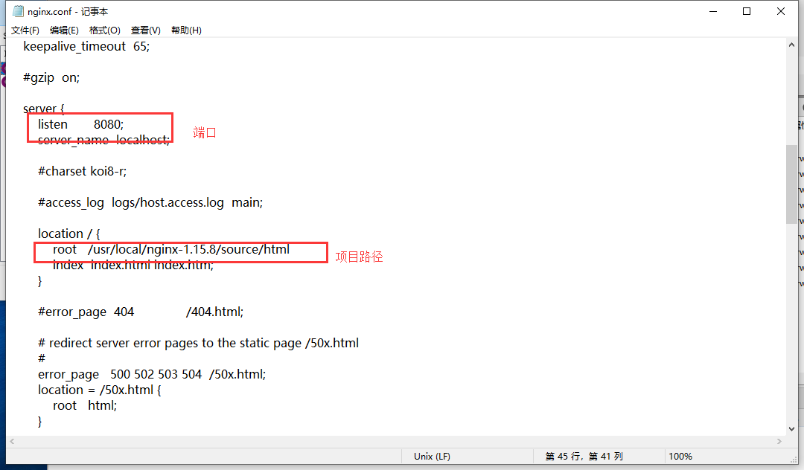

[](http://www.runoob.com/linux/nginx-install-setup.html)


总操作流程：
- 1、[安装编译工具及库文件](#Nginx-01)
- 2、[首先要安装 PCRE](#Nginx-02)
- 3、[安装 Nginx](#Nginx-03)
- 4、[Nginx 配置](#Nginx-04)
- 5、[启动 Nginx](#Nginx-05)
- 6、[访问站点](#Nginx-06)

----------

# <a name="Nginx-01" href="#" >安装编译工具及库文件</a>
```
yum -y install make zlib zlib-devel gcc-c++ libtool  openssl openssl-devel
```
# <a name="Nginx-02" href="#" >首先要安装 PCRE</a>
`注意：安装到/usr/local目录下`
```
#下载
wget http://downloads.sourceforge.net/project/pcre/pcre/8.35/pcre-8.35.tar.gz

#进入目录
cd pcre-8.35

#编译安装 
./configure
make && make install

#查看pcre版本
pcre-config --version
```
# <a name="Nginx-03" href="#" >安装 Nginx</a>
```
#下载 Nginx
wget http://nginx.org/download/nginx-1.6.2.tar.gz

#解压安装包
tar zxvf nginx-1.6.2.tar.gz

#进来目录
cd nginx-1.6.2

#编译安装
./configure --prefix=/usr/local/webserver/nginx --with-http_stub_status_module --with-http_ssl_module --with-pcre=/usr/local/pcre-8.35

make

make install

#查看nginx版本
/usr/local/webserver/nginx/sbin/nginx -v
```
# <a name="Nginx-04" href="#" >Nginx 配置</a>
### 1、创建 Nginx 运行使用的用户 www：
```
/usr/sbin/groupadd www 

/usr/sbin/useradd -g www www
```
### 2、配置nginx.conf
```
vi /usr/local/webserver/nginx/conf/nginx.conf
```
替代文件内容：
```
user www www;
worker_processes 2; #设置值和CPU核心数一致
error_log /usr/local/webserver/nginx/logs/nginx_error.log crit; #日志位置和日志级别
pid /usr/local/webserver/nginx/nginx.pid;
#Specifies the value for maximum file descriptors that can be opened by this process.
worker_rlimit_nofile 65535;
events
{
  use epoll;
  worker_connections 65535;
}
http
{
  include mime.types;
  default_type application/octet-stream;
  log_format main  '$remote_addr - $remote_user [$time_local] "$request" '
               '$status $body_bytes_sent "$http_referer" '
               '"$http_user_agent" $http_x_forwarded_for';
  
#charset gb2312;
     
  server_names_hash_bucket_size 128;
  client_header_buffer_size 32k;
  large_client_header_buffers 4 32k;
  client_max_body_size 8m;
     
  sendfile on;
  tcp_nopush on;
  keepalive_timeout 60;
  tcp_nodelay on;
  fastcgi_connect_timeout 300;
  fastcgi_send_timeout 300;
  fastcgi_read_timeout 300;
  fastcgi_buffer_size 64k;
  fastcgi_buffers 4 64k;
  fastcgi_busy_buffers_size 128k;
  fastcgi_temp_file_write_size 128k;
  gzip on; 
  gzip_min_length 1k;
  gzip_buffers 4 16k;
  gzip_http_version 1.0;
  gzip_comp_level 2;
  gzip_types text/plain application/x-javascript text/css application/xml;
  gzip_vary on;
 
  #limit_zone crawler $binary_remote_addr 10m;
 #下面是server虚拟主机的配置
 server
  {
    listen 80;#监听端口
    server_name localhost;#域名
    index index.html index.htm index.php;
    root /usr/local/webserver/nginx/html;#站点目录
      location ~ .*\.(php|php5)?$
    {
      #fastcgi_pass unix:/tmp/php-cgi.sock;
      fastcgi_pass 127.0.0.1:9000;
      fastcgi_index index.php;
      include fastcgi.conf;
    }
    location ~ .*\.(gif|jpg|jpeg|png|bmp|swf|ico)$
    {
      expires 30d;
  # access_log off;
    }
    location ~ .*\.(js|css)?$
    {
      expires 15d;
   # access_log off;
    }
    access_log off;
  }

}
```
# <a name="Nginx-05" href="#" >启动 Nginx</a>
```
/usr/local/webserver/nginx/sbin/nginx
```
# <a name="Nginx-06" href="#" >测试</a>
用浏览器ip


