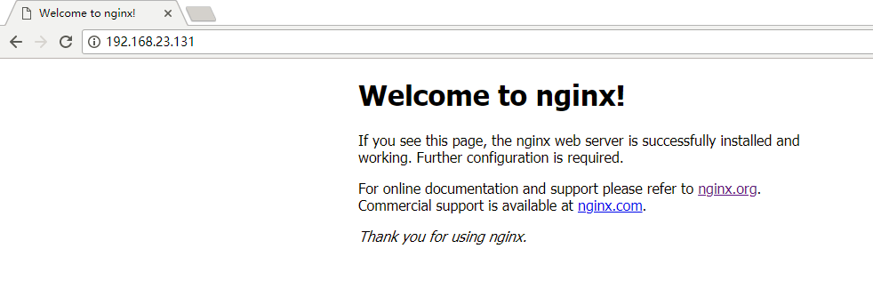

总操作流程：
- 1、修改配置；
- 2、测试；

----------

# 修改配置
```
vim /etc/sysconfig/iptables
```
放在icmp-host-prohibited上面
```
-A INPUT -m state --state NEW -m tcp -p tcp --dport 80 -j ACCEPT
```

```
service iptables restart #重启
```
# 测试
浏览器输入ip：192.168.23.131

