总操作流程：
- 1、[下载iso](#kail-linux-01)
- 2、[安装](#kail-linux-02)
- 3、[看效果](#kail-linux-03)

***

# <a name="kail-linux-01" href="#" >下载iso</a>

[](https://www.kali.org/downloads/)

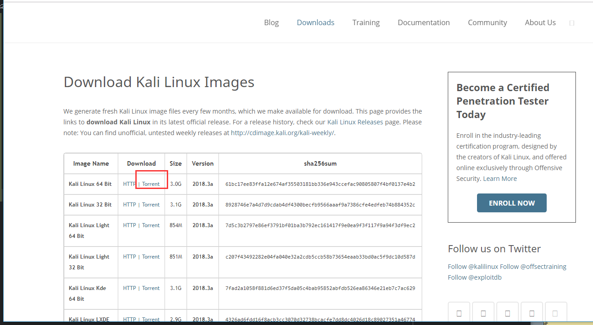

# <a name="kail-linux-02" href="#" >安装</a>

> 1、虚拟机的设置

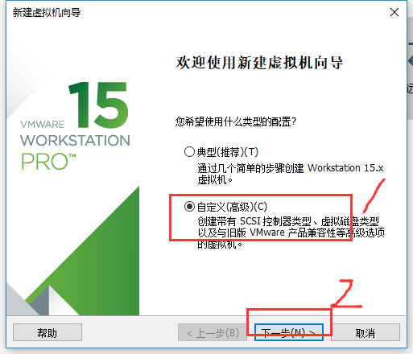

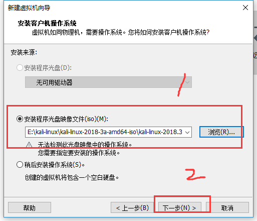

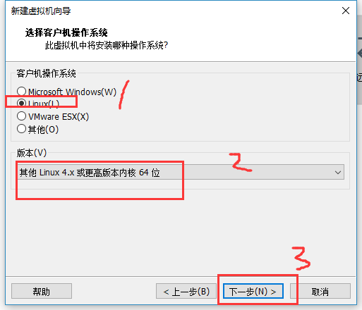

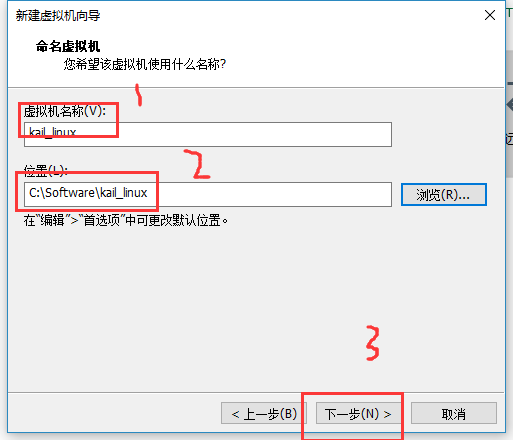

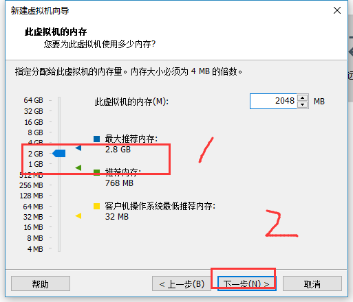

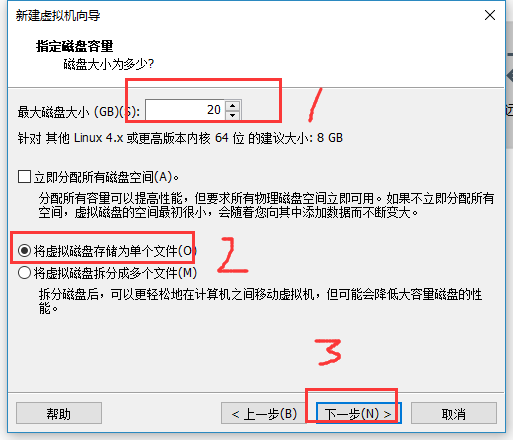

> 2、安装过程中的设置

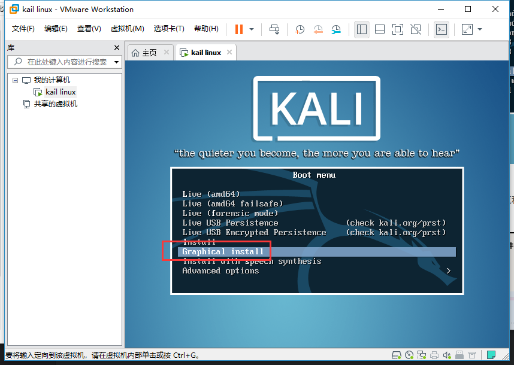

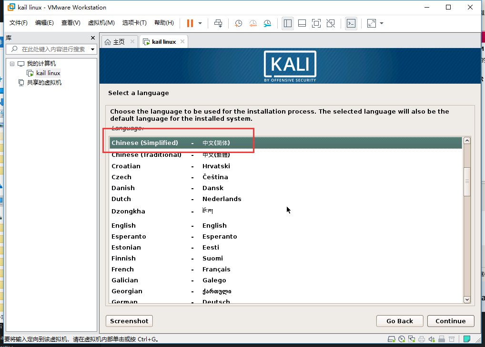

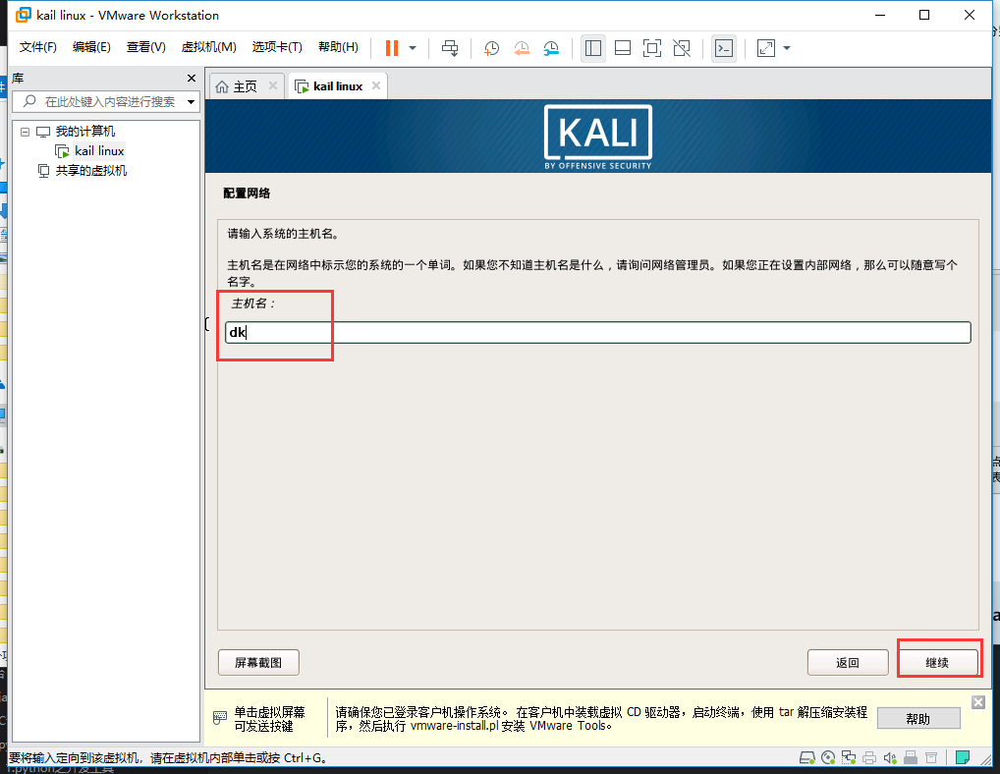

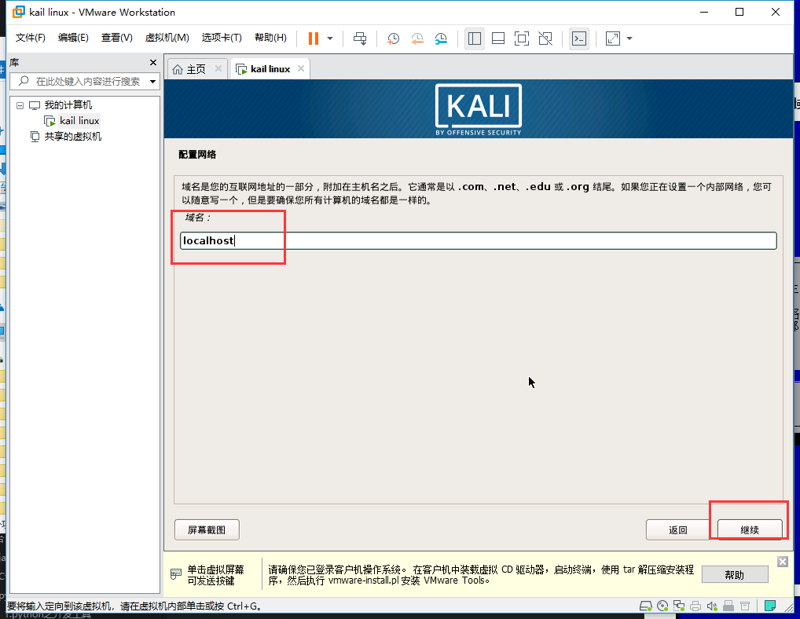

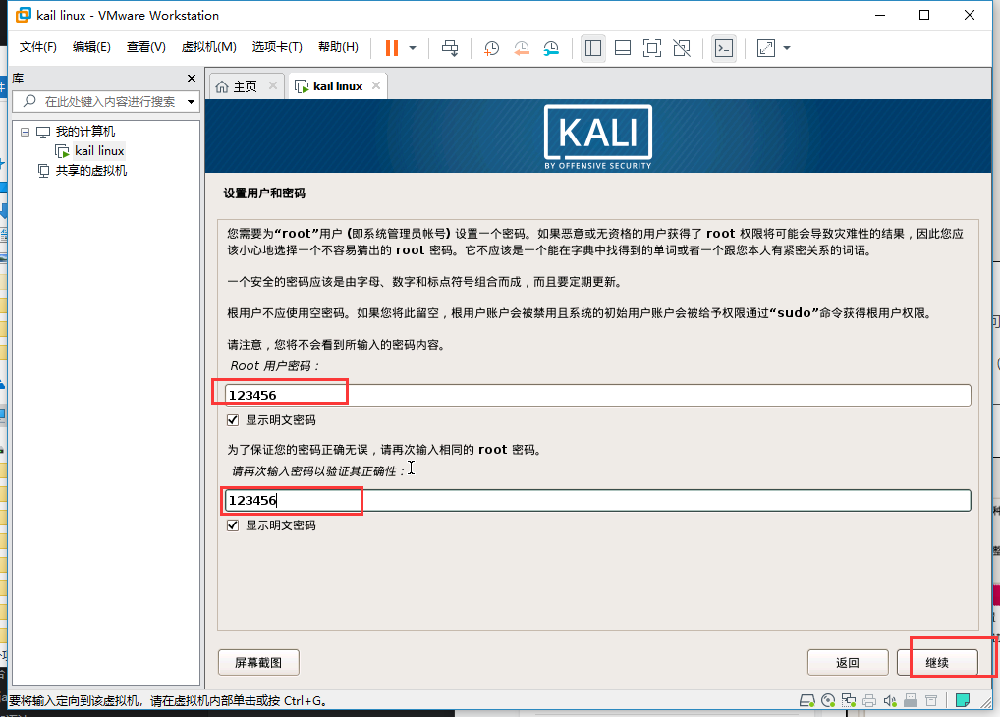

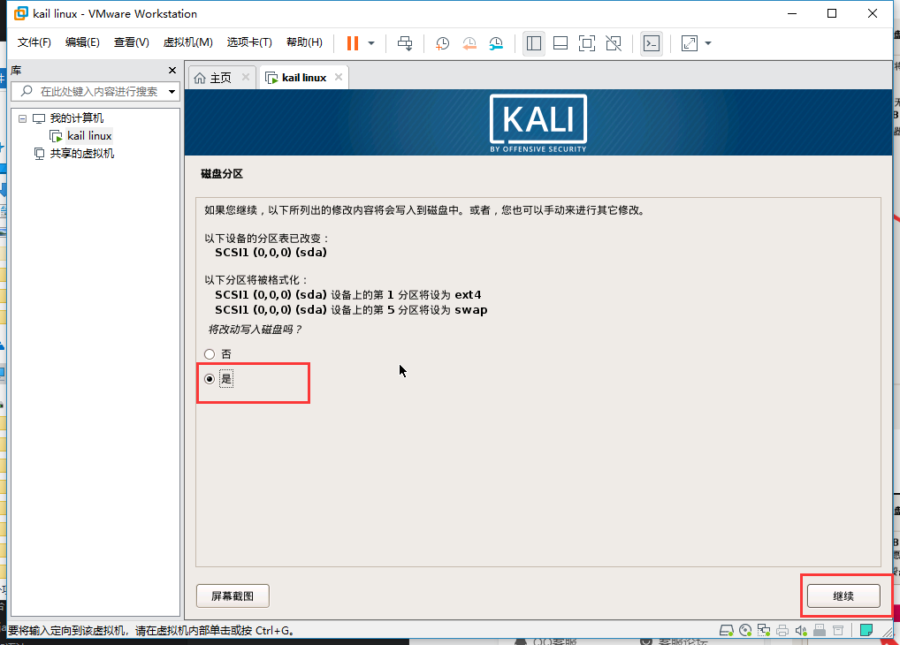

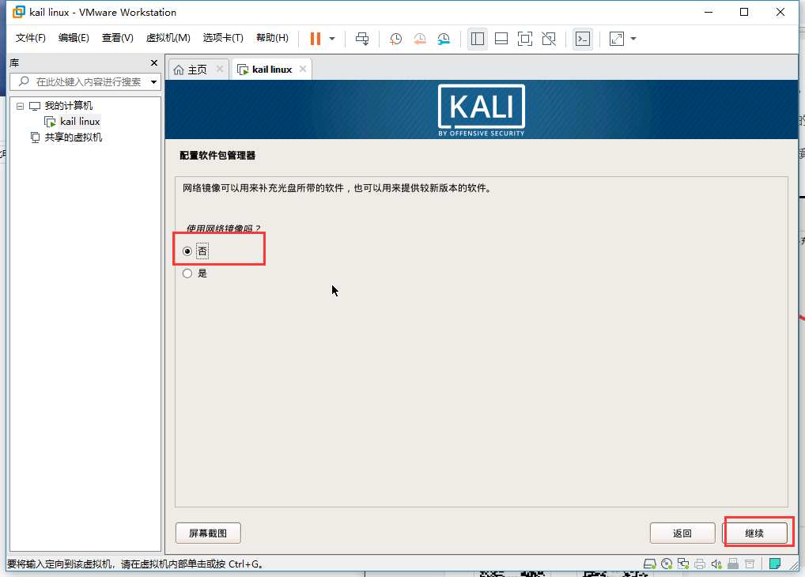

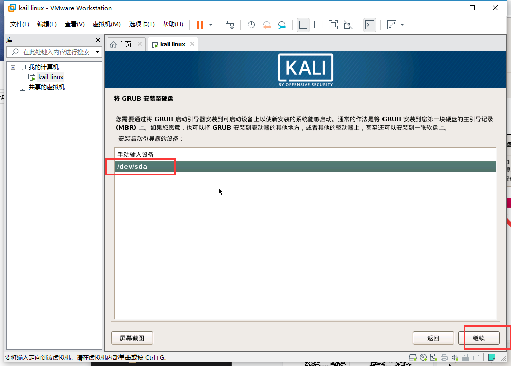

# <a name="kail-linux-03" href="#" >看效果</a>

```
用户名：root
密码：123456
```

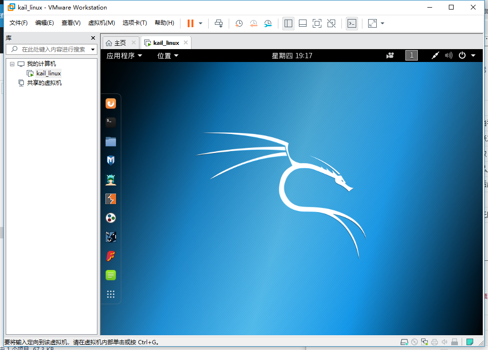
