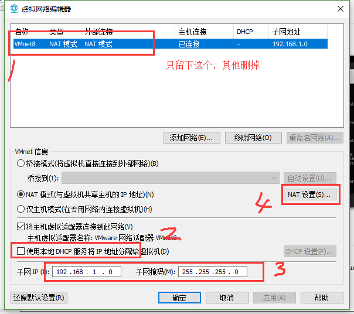
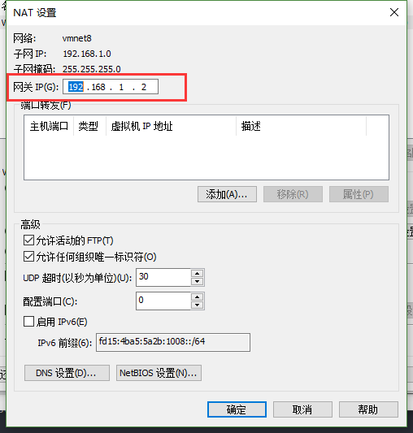
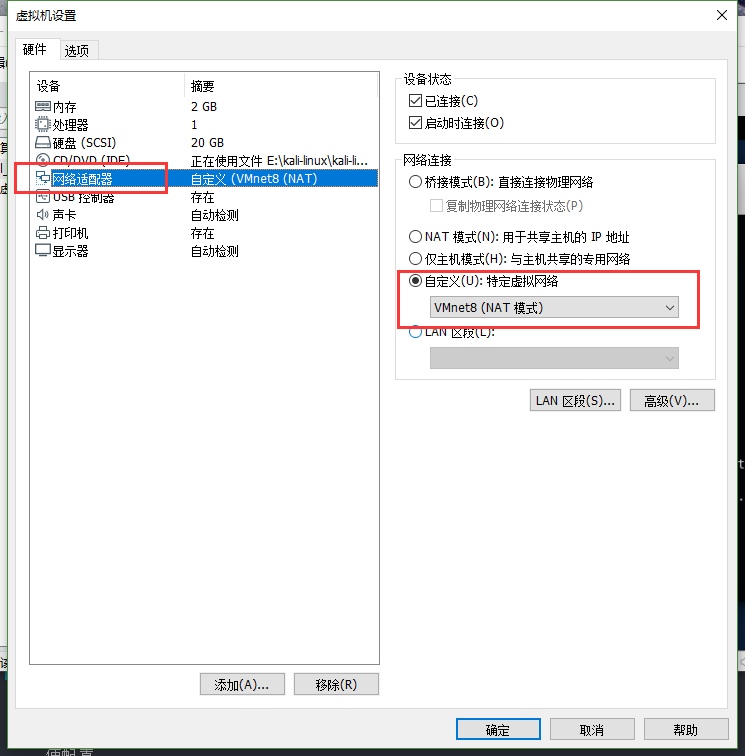
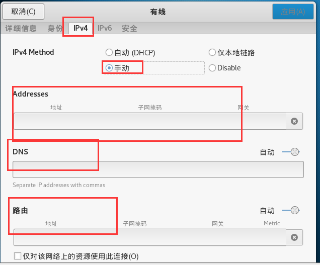

总操作流程：
- 1、[自动获得ip地址](#kail-linux-01)
- 2、[建立临时的ip配置](#kail-linux-02)
  - 2.[1、指定ip地址](#kail-linux-02-01)
  - 2.[2、指定网关](#kail-linux-02-02)
  - 2.[3、其他网段添加静态路由](#kail-linux-02-03)
- 3、[固定的ip配置](#kail-linux-03)
- 4、[图形方式建立](#kail-linux-04)

***

# <a name="kail-linux-012" href="#" >自动获得ip地址</a>

```shell
dhclient eth0
```

# <a name="kail-linux-02" href="#" >建立临时的ip配置</a>

### <a name="kail-linux-02-01" href="#" >1、指定ip地址</a>

```shell
ifconfig eth0 192.168.1.10/24  # 指定ip地址

ifconfig etho # 查询ip

```

### <a name="kail-linux-02-02" href="#" >2、指定网关（联网的）</a>
```shell
route add default gw 192.168.1.10 # 指定网关

netstat -nr # 查询是否生效
```


### <a name="kail-linux-02-03" href="#" >3、添加静态路由（上网）</a>

- 应用场景

```
kail linux下有三层交换机，三层交换机有多个网段，每个网段有自己不同的ip地址。
```


> 1、命令添加

```shell
# net后面的是网关 ；/24是添加网络地址；/32是添加主机地址；  gw是添加网段地址
route add -net 192.168.1.10/24 gw 192.168.1.100 eth0

route -n # 查询路由
```

> 2、手动添加dnf服务器

```shell
vi /etc/resolv.conf
```

```shell
nameserver 8.8.8.8
nameserver 114.114.114.114
```

#  <a name="kail-linux-04" href="#" >固定的ip配置</a>

> 1、修改网卡的配置文件

- 进入配置文件

```shell
vi /etc/network/interfaces
```

- 编辑配合文件

```shell
# The primary network interface
auto eth0
allow hotplup eth0 
iface eth0 inet static                          # 设定静态
address 192.168.1.0                            # 设置ip地址
netmask 255.255.255.0                           # 设置子网掩码
gateway 192.168.1.2                             # 设置网关
network 192.168.1.3                             # 设置网段
broadcast 192.168.1.4                           # 设置子网广播地址
dns-nameservers 192.168.1.5 192.168.1.6         # 设置dns服务器

```

> 2、手动添加dnf服务器

```shell
vi /etc/resolv.conf
```

```shell
nameserver 8.8.8.8
nameserver 114.114.114.114
```

- 使配置

```shell
 service network restart #重启网卡
```

>3、设置虚拟机配置







# <a name="kail-linux-05" href="#" >图形方式建立</a>





