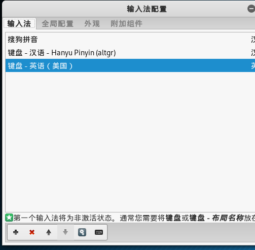
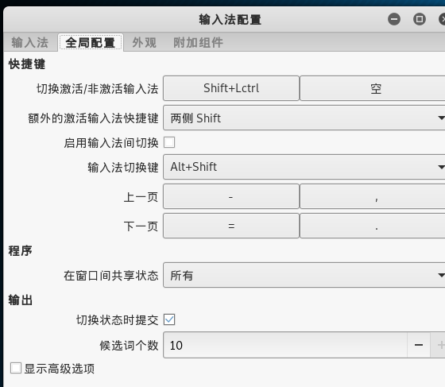

总操作流程：
- 1、[添加源](#kail-linux-01)
- 2、[ 安装](#kail-linux-02)
- 3、[配置](#kail-linux-03)

--------------

#  <a name="kail-linux-01" href="#" >添加源</a>

```js
vim /etc/apt/sources.list
```

```js
deb http://http.kali.org/kali kali-rolling main non-free contrib
deb http://mirrors.aliyun.com/kali kali-rolling main non-free contrib
```

#  <a name="kail-linux-02" href="#" >安装</a>

```js
apt-get install fcitx fcitx-libs-qt

apt-get --fix-broken install

cd /usr/local
```

[](https://pinyin.sogou.com/linux/?r=pinyin)

```js
dpkg -i 下载的sogo安装包文件名

reboot
```

#  <a name="kail-linux-03" href="#" >配置</a>




