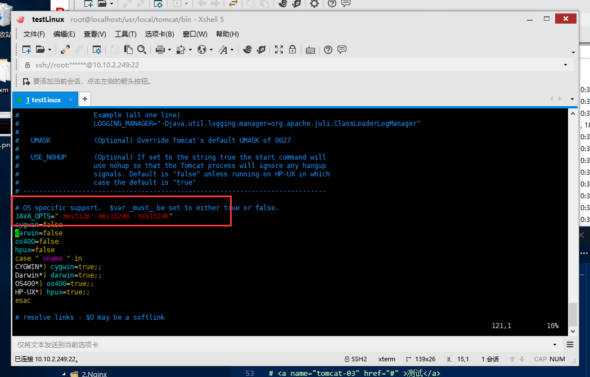
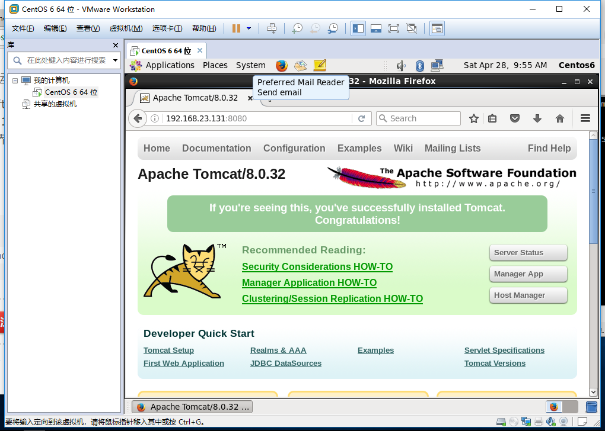

总操作流程：
- 1.[下载安装](#tomcat-01)
- 2.[配置](#tomcat-02)
- 3.[测试](#tomcat-03)

----------

# <a name="tomcat-01" href="#" >下载安装</a>

[](https://pan.baidu.com/s/1baB4TzFkYR2TcnB-EydYHA)


上传linux

```shell
cd /usr/local

tar zxvf apache-tomcat-8.0.32.tar.gz #解压文件

mv apache-tomcat-8.0.32 tomcat #修改名字
```
# <a name="tomcat-02" href="#" >配置</a>

>1、配置变量环境
```shell
vi /etc/profile
```

```shell
#set tomcat environment
CATALINA_BASE=/usr/local/tomcat
PATH=$PATH:$CATALINA_BASE/bin
export PATH CATALINA_BASE
```

```shell
source /etc/profile #让修改生效

catalina.sh version #查看版本
```
>2、修改配置文件



``` shell
vim /usr/local/tomcat/bin/catalina.sh
```

```shell
JAVA_OPTS="-Xms512m -Xmx1024m -Xss1024K -XX:PermSize=512m -XX:MaxPermSize=1024m"
export TOMCAT_HOME=/usr/local/tomcat
export CATALINA_HOME=/usr/local/tomcat
export JRE_HOME=/usr/local/java/jdk
export JAVA_HOME=/usr/local/java/jdk
```

# <a name="tomcat-03" href="#" >测试</a>
```shell
cd ~

cd /usr/local/tomcat/bin

./startup.sh

```

>其他命令
```shell
cd ~

cd /usr/local/tomcat/bin

./shutdown.sh #关闭

 ps -ef|grep java  # 查询状态
```

