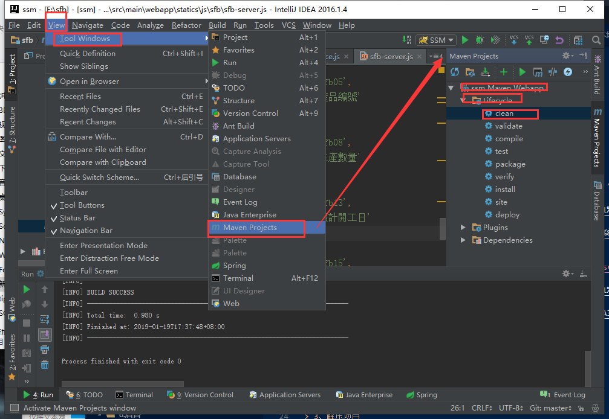
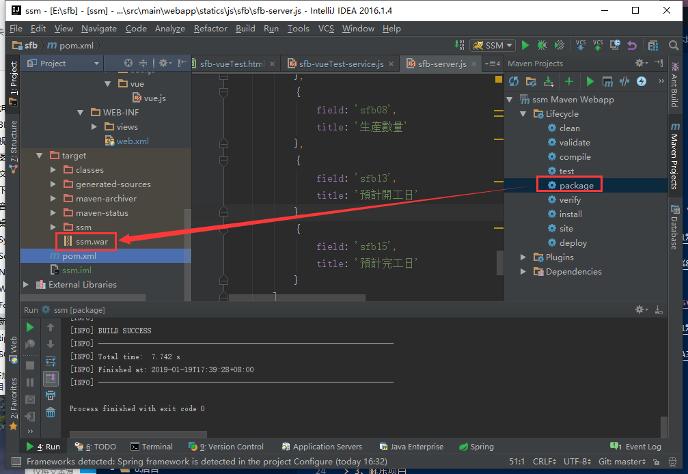

总操作流程：
- 1、Javaweb运行环境确认
- 2、上传项目
- 3、看效果

***

# Javaweb运行环境确认

> 本Javaweb是ssm+oracle+maven

centos要安装jdk，tomcat

[](https://github.com/OurNotes/CCN/blob/master/4.%E6%9C%8D%E5%8A%A1%E5%99%A8/1.linux/2.linux%E4%B9%8B%E5%AE%89%E8%A3%85%E8%BD%AF%E4%BB%B6/6-Linux%E4%B9%8B%E5%AE%89%E8%A3%85JDK.md)

[](https://github.com/OurNotes/CCN/blob/master/4.%E6%9C%8D%E5%8A%A1%E5%99%A8/3.tomcat/1.tomcat%E4%B9%8B%E5%AD%A6%E4%B9%A0/1-tomcat%E4%B9%8B%E5%AE%89%E8%A3%85%E9%85%8D%E7%BD%AE.md)

注意：maven无法下载oracle驱动包的，将oracle包手动加到lib文件夹下

# 上传项目

> 1、导出项目

- 先清理项目



- 导出项目



> 2、上传项目

- 将项目解压出来，放到ssm文件夹下

- 上传项目到/usr/local/tomcat/webapps文件夹下

> 3、修改server.xml配置

```xml
<Context path="/" docBase="ssm" reloadable="true"/>  
```

# 看效果

```
http://ip地址:tomcat端口
```
