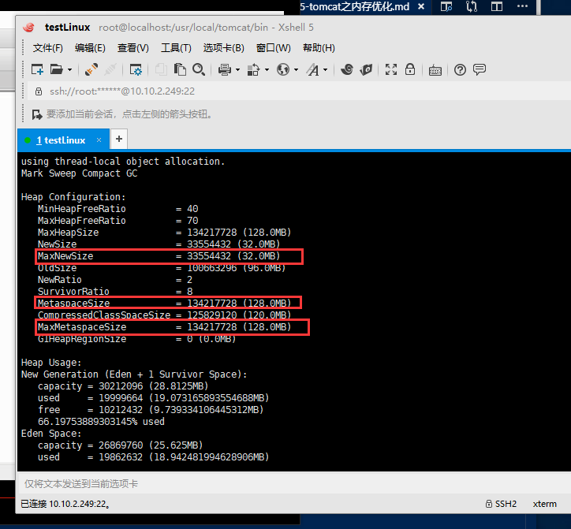

总操作流程:
- 1、配置tomcat的catalina.sh文件
- 2、看效果

***

# 配置tomcat的catalina.sh文件

```shell
vim /usr/local/tomcat/bin/catalina.sh
```

```shell
# OS specific support.  $var _must_ be set to either true or false.
JAVA_OPTS="-Xms512m -Xmx1024m -Xss1024K"
```
# 看效果

```shell
ps -ef|grep tomcat  #查询编号

jmap -heap xxxx
```

