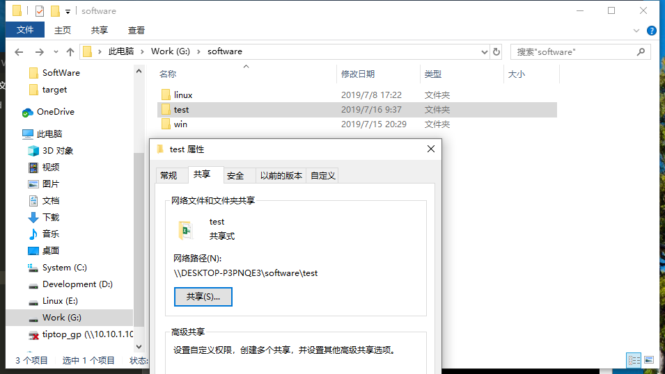

总操做流程：
- 1、windows创建共享文件夹
- 2、linux创建文件夹
- 3、测试

***

# windows创建共享文件夹



# linux创建文件夹

```shell

mkdir /home/test

mount -t cifs -o username=admin,password=LEDDNS //10.10.2.176/software/test /home/test
```

# 测试

创建文件互相查看


