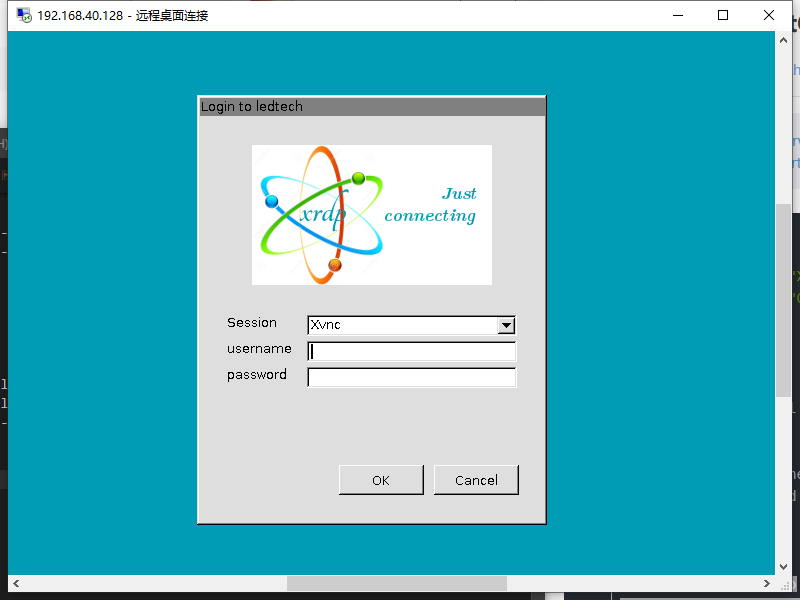

总操作流程：
- 1、安装CentOS桌面
- 2、安装xrdp
- 3、添加防火墙
- 4、测试

***

# 安装CentOS桌面

```shell
yum upgrade
yum -y groupinstall "X Window System" 
yum -y groupinstall "GNOME Desktop"
startx
```
# 安装xrdp

```shell
yum install epel* -y
yum --enablerepo=epel -y install xrdp
```

# 添加防火墙

```shell
firewall-cmd --permanent --zone=public --add-port=3389/tcp
firewall-cmd --reload
```

# 测试


```
systemctl start xrdp
systemctl enable xrdp
netstat -tnlp | grep xrdp
```



