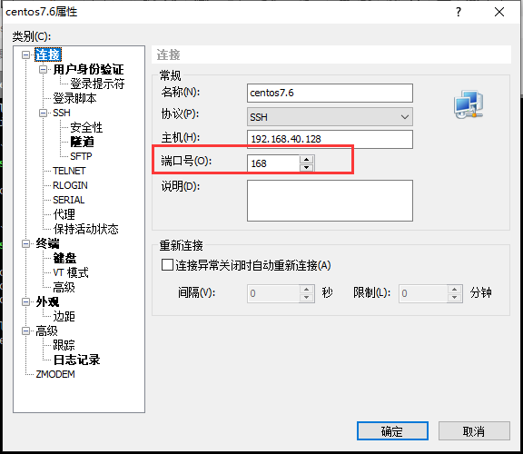

总操作流程：
- 1、修改配置文件
- 2、设置防火墙
- 3、测试

***

# 修改配置文件

>1、修改sshd的配置

```
su

vim /etc/ssh/sshd_config
```

```
#Port 22
Port 168 
```

> 2、将端口添加到SELinux

```
semanage port -a -t ssh_port_t -p tcp 168

semanage port -l | grep ssh #确认是否添加进去
```

# 设置防火墙

```
firewall-cmd --permanent --zone=public --add-port=168/tcp
firewall-cmd --reload
firewall-cmd --zone=public --query-port=168/tcp #查看添加端口是否成功
```

# 测试

> 重启ssh

```
systemctl restart sshd.service 
```

> 2、使用ssh连接

