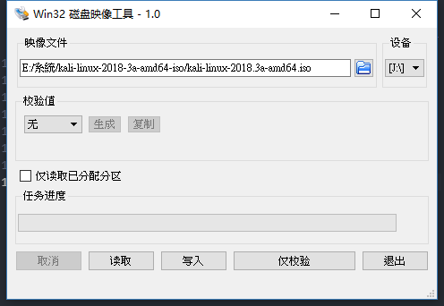
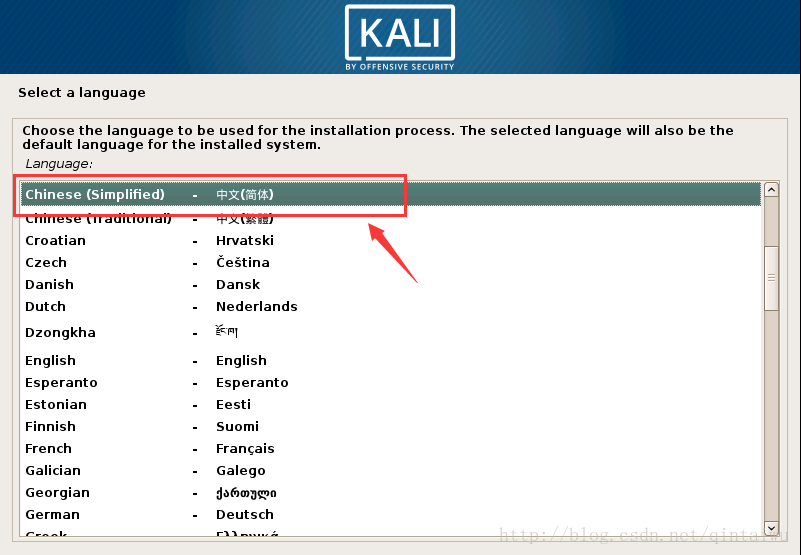
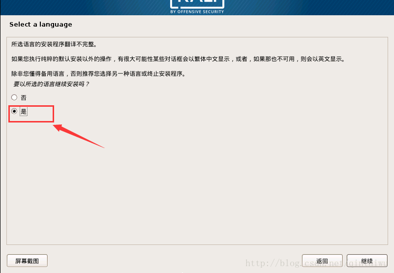
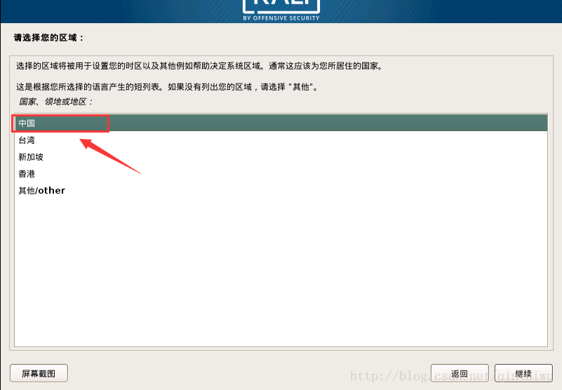
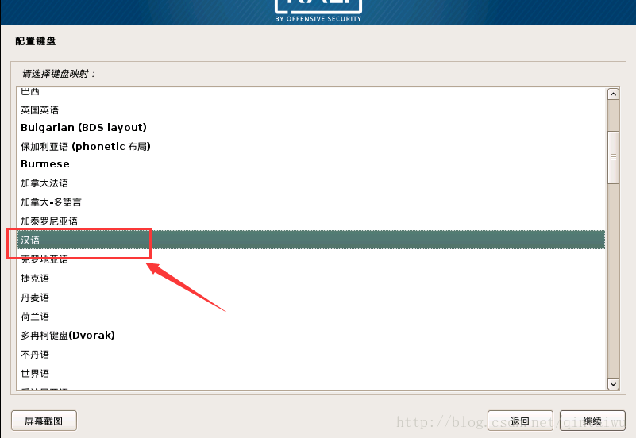
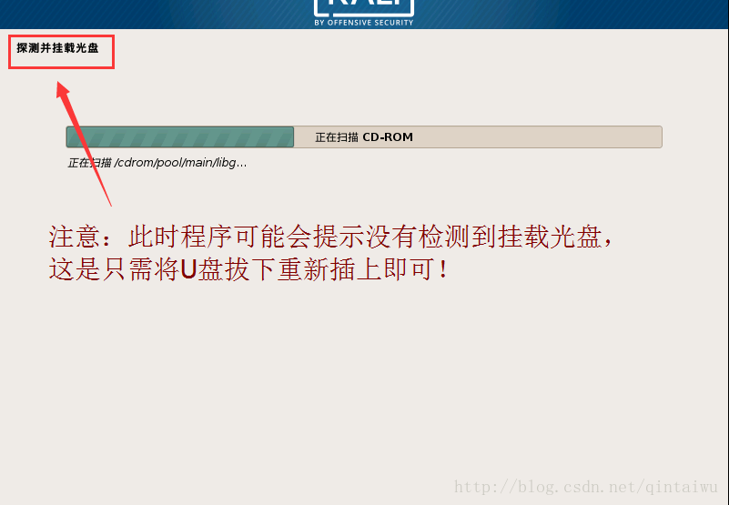

本页目录:
- 1、[下载安装刻录软件](#kail-linux-01)
- 2、[刻录u盘](#kail-linux-02)
- 3、[安装系统](#kail-linux-03)

***

# <a name="kail-linux-01" href="#" >下载安装刻录软件</a>

>本实验用这软件刻录可以安装，用别的不行

# <a name="kail-linux-02" href="#" >刻录u盘</a>

# <a name="kail-linux-03" href="#" >安装系统</a>

