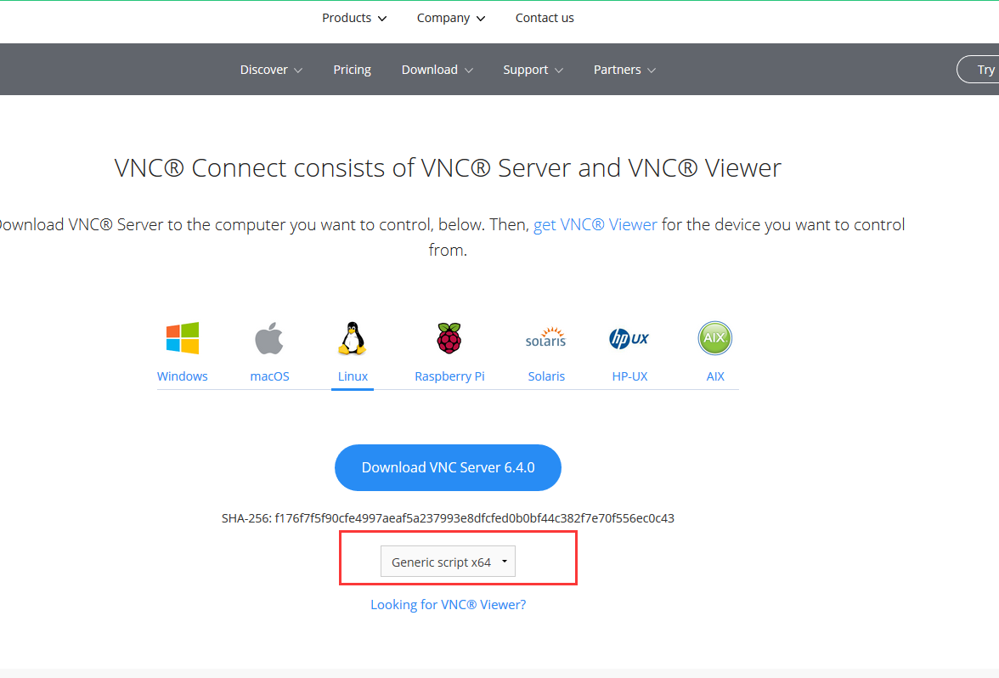

总操作流程：
- 1、下载安装
- 2、配置
- 3、测试

***

# 下载安装

> 1、下载

[](https://github.com/neutrinolabs/xrdp/releases/tag/v0.9.9)

[](https://www.realvnc.com/en/connect/download/vnc/linux/)



- 将文件移到分享文件夹下

```
cd /mnt/hgfs/shared

ls

```

> 2、安装xrdp

```
cd ~

cd /mnt/hgfs/shared

tar zxvf xrdp-0.9.9.tar.gz

cd xrdp-0.9.9

./configure --prefix=/usr/local/xrdp  --with-internal-glib

make && make install

rm -rf xrdp-0.9.9
```

> 3、安装vnc-server


# 配置


# 测试