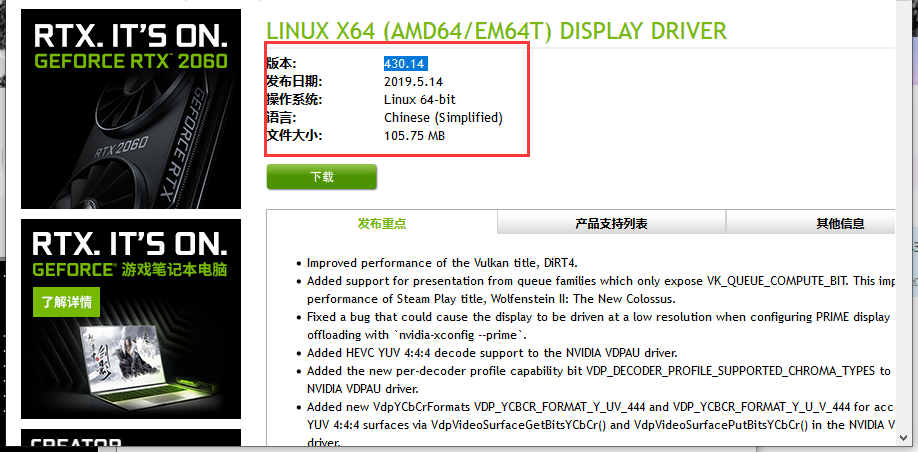

总操作流程：
- 1、下载安装
- 2、测试

***

# 下载安装

>1、配置好编译环境
```
apt-get install aptitude
aptitude install nvidia-kernel-dkms
apt-get install mesa-utils apt-file
apt-get install -y linux-headers-$(uname -r)
apt-get install nvidia-kernel-dkms
apt-get dist-upgrade
sed 's/quiet/quiet nouveau.modeset=0/g' -i /etc/default/grub
update-grub
reboot
```

>2、下载安装NVIDIA

- 下载

[](https://www.nvidia.cn/Download/index.aspx?lang=cn)


- 安装

```c
systemctl stop gdm.service

cd /usr/local #上传下载后的文件到这

chmod a+x 软件名.run

sh ./软件名.run

```


- 编译nvidia驱动至内核

```

/lib/modules/

ls #查看内核名

```





- 安装配置

```c
sudo dkms autoinstall -k  4.19.0-kali5-amd64  -m nvidia-430 -v 430.14

reboot
```

# 测试

- 要在本机上运行，在远程软件上运行不会显示的

```
glxinfo | grep direct
```
- 成功标志
```
direct rendering: Yes
```