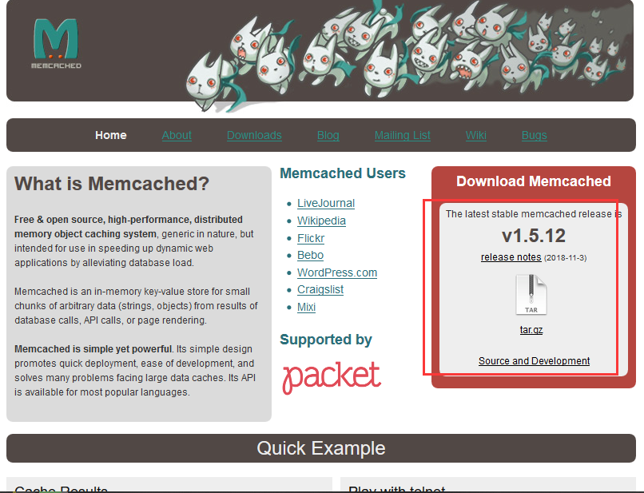
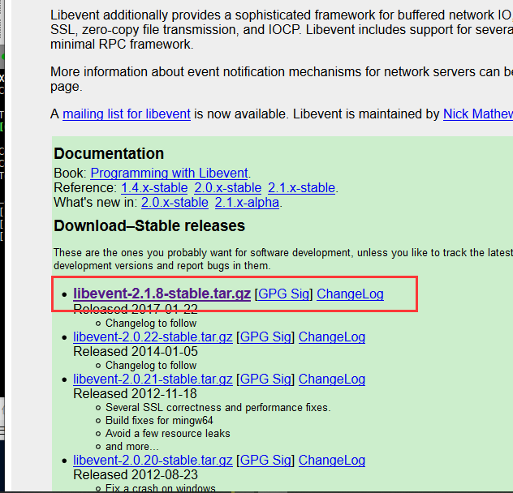

总操作流程：
- 1、下载安装
- 2、测试

***

# 下载安装
> 1、下载

[](http://memcached.org/)



[](http://libevent.org/)



> 2、安装libevent

```
cd ~ 

cd /usr/local

tar -zxvf libevent-*

cd libevent-2.1.8-stable

./configure --prefix=/usr/local/libevent

make && make install

cd ..

rm -rf libevent-2.1.8-stable

```
> 3、安装memcached

```
cd ~ 

cd /usr/local

tar -zxvf memcached-*

cd memcached-1.5.12

./configure --prefix=/usr/local/memcached --with-libevent=/usr/local/libevent

make && make install

cd ..

rm -rf memcached-1.5.12
```

# 测试

```
/usr/local/memcached/bin/memcached -h 
```

