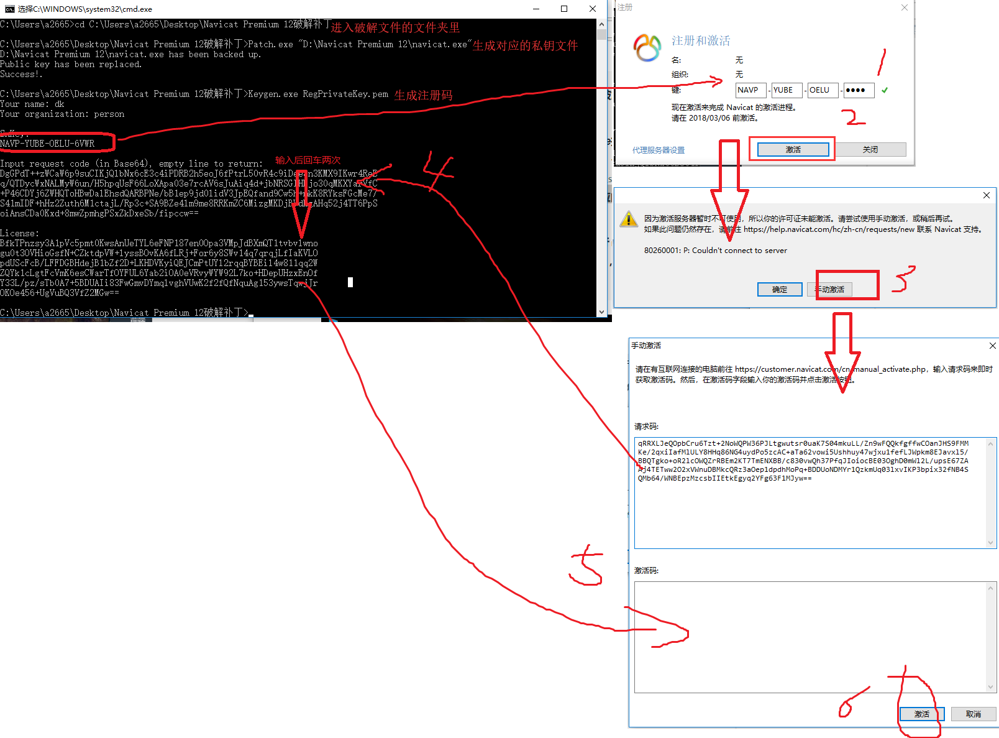

[参考文献](https://www.jianshu.com/p/5f693b4c9468?mType=Group)

总操作流程:
- 1、下载文件
- 2、破解

----------

`注意：操作要断开网络`

# 1、下载文件
[exe](https://pan.baidu.com/s/1kWe9AIV)
[破解文件](https://pan.baidu.com/s/1dG003Xv)
# 2、破解
dos命令进入界面
```
cd C:\Users\a2665\Desktop\Navicat Premium 12破解补丁 #进入破解文件的文件夹里

Patch.exe "D:\Navicat Premium 12\navicat.exe" #生成私钥文件

Keygen.exe RegPrivateKey.pem #生成Navicat 12的注册码
```
