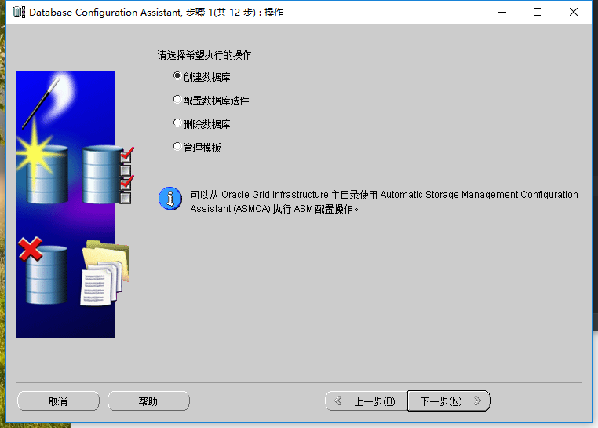
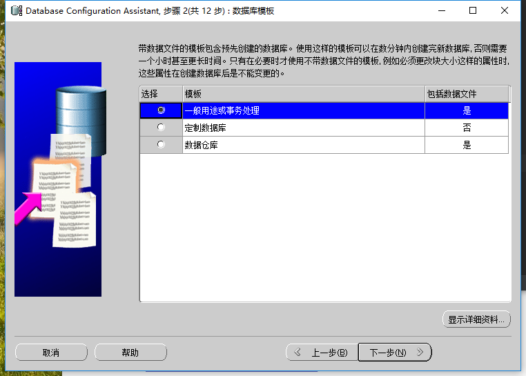

总操作流程：
- 1、下载安装；
- 2、创建Oracle数据库；
- 3、配置Oracle；
- 4、在navicat上使用；

***

# 下载安装
### 1、下载
[](https://pan.baidu.com/s/1EBKkDBTzpgWdY68etnZrWw)

### 2、安装
解压点击exe文件安装


# 创建Oracle数据库





# 配置Oracle
### 1、修改listener.ora文件


```
	(SID_DESC =
		(SID_NAME=ORCL)
		(ORACLE_HOME=D:\Oracle11gR2\app\admin\product\11.2.0\dbhome_1)
	)
```

```
	  (CONNECT_DATA=(SERVER=DEDICATED)(SID=myOracle))
```
### 2、启动Oracle服务

控制面板 > 系统和安全 > 管理工具 > 服务


# 在navicat上使用

