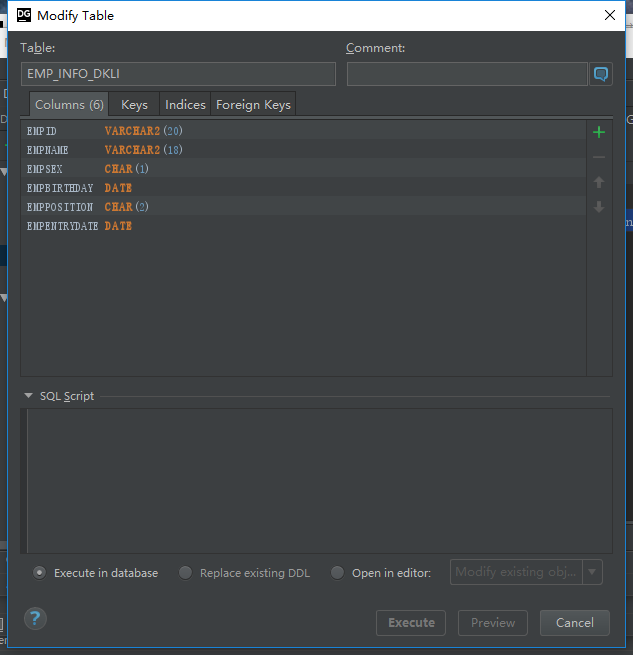

# 语法
```
create table EMP_INFO_DKLi
(
	EMPID VARCHAR2(20) not null,
	EMPNAME VARCHAR2(18) not null,
	EMPSEX CHAR not null,
	EMPBIRTHDAY DATE not null,
	EMPPOSITION CHAR(2) not null,
	EMPENTRYDATE DATE not null
);
```
# 展现效果
