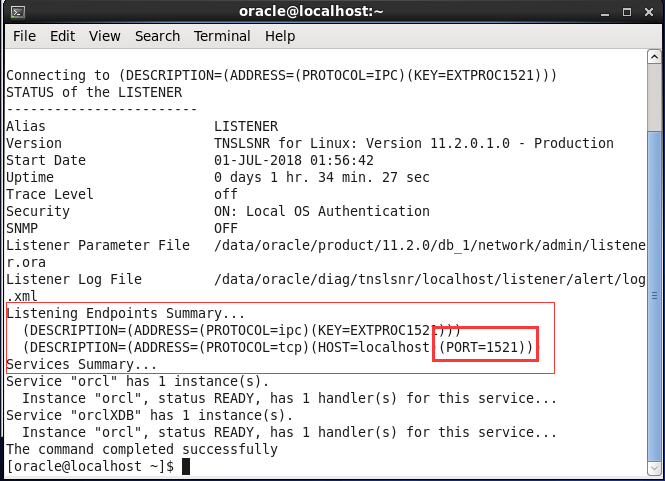
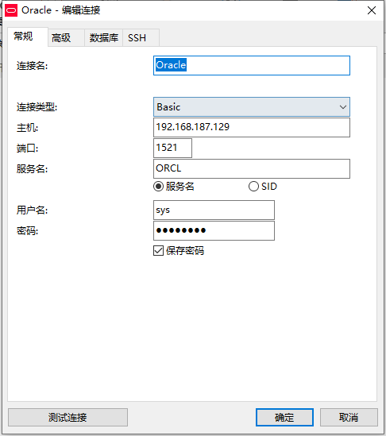
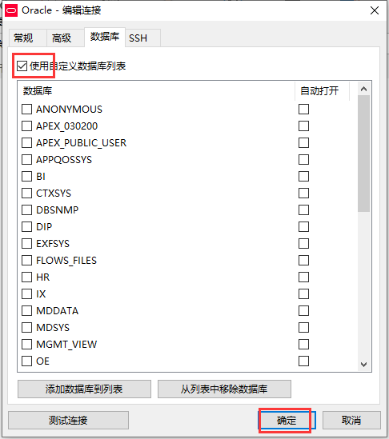

总操作流程：
- 1、[获取Oracle的端口号](#Oracle-01)
- 2、[设置防火墙](#Oracle-02)
- 3、[给数据库实例外连接设置](#Oracle-03)
- 4、[测试](#Oracle-04)

***

# 获取Oracle的端口号
```
lsnrctl status #查看监听器的状态
```


# 设置防火墙

```
firewall-cmd --permanent --zone=public --add-port=1521/tcp
firewall-cmd --reload
```


# 给数据库实例外连接设置

> 开启允许远程
```
netmgr
```


> 改配置

```shell
vim /opt/oracle/install/product/11.2.0/db_1/network/admin/listener.ora
```

```shell
(ADDRESS = (PROTOCOL = TCP)(HOST =admin)(PORT = 1521)) 
改为：
(ADDRESS = (PROTOCOL = TCP)(HOST =虚拟机分配的ip)(PORT = 1521))
```

> 开启监听

```shell
lsnrctl start
```

# 测试



