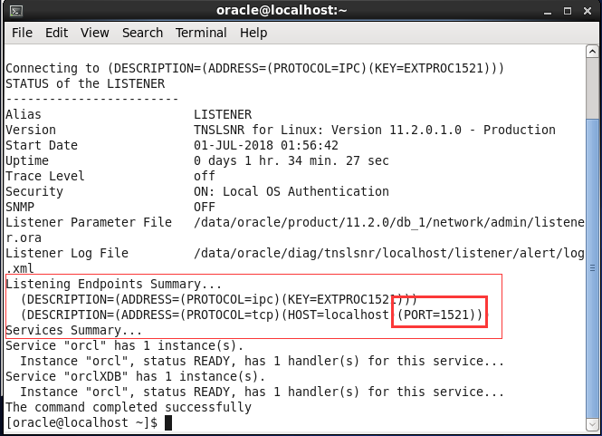
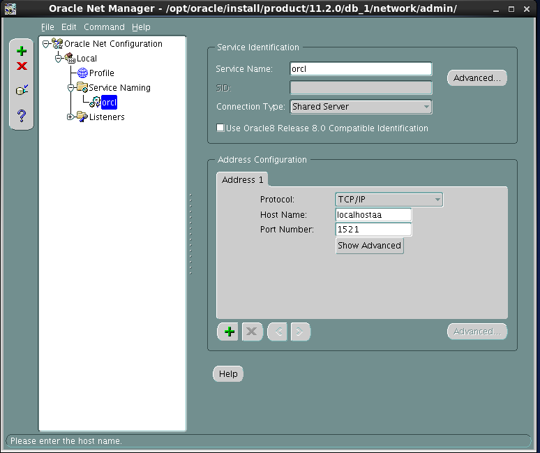
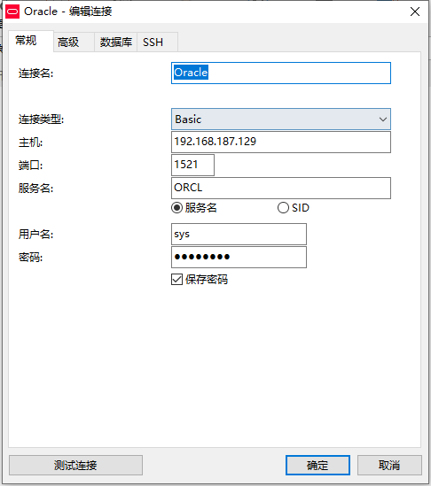
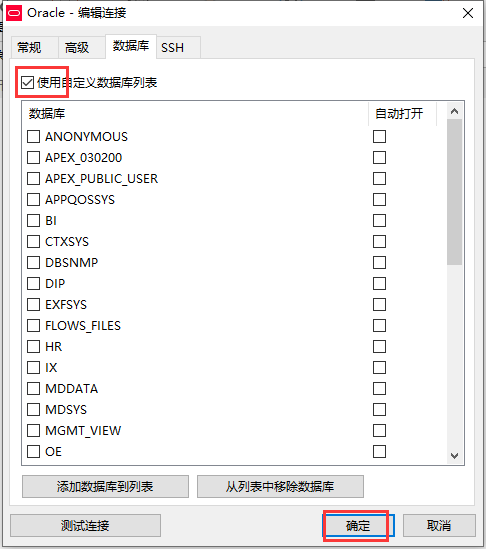

总操作流程：
- 1、[获取Oracle的端口号](#Oracle-01)
- 2、[设置防火墙](#Oracle-02)
- 3、[给数据库实例外连接设置](#Oracle-03)
- 4、[测试](#Oracle-04)

***

# <a name="Oracle-01" href="#" >获取Oracle的端口号</a>
```
lsnrctl status #查看监听器的状态
```


# <a name="Oracle-02" href="#" >设置防火墙</a>

```
su

vi  /etc/sysconfig/iptables #打开防火墙配置文件
```

>添加内容
```
-A INPUT -m state --state NEW -m tcp -p tcp --dport 1521 -j ACCEPT
```


>重启防火墙

```
service  iptables restart
```


# <a name="Oracle-03" href="#" >给数据库实例外连接设置</a>

```
netmgr
```


# <a name="Oracle-04" href="#" >测试</a>



