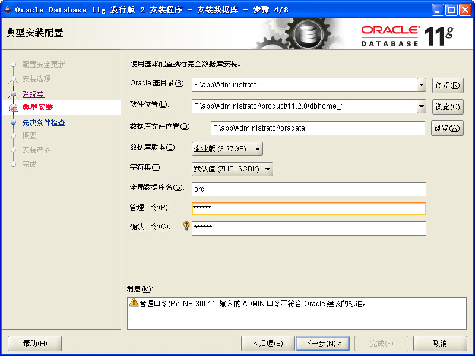
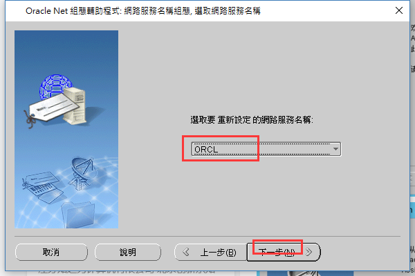
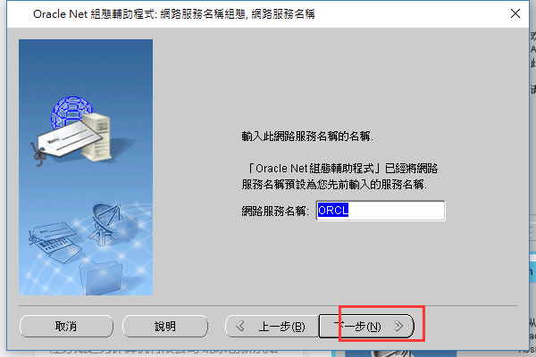

本页目录：
- 1、[下载安装](#Oracle-01)
- 2、[修改配置](#Oracle-02)
- 3、[使用navicat premium链接](#Oracle-03)

***

# <a name="Oracle-01" href="#" >下载安装</a>

> 1、下载
[](https://www.oracle.com/downloads/index.html#database)


> 2、安装


```
密码：123456
```





# <a name="Oracle-02" href="#" >修改配置</a>

>修改tnsnames.ora文件


> 修改listener.ora文件


> 重置监听程序








# <a name="Oracle-03" href="#" >使用navicat premium链接</a>


