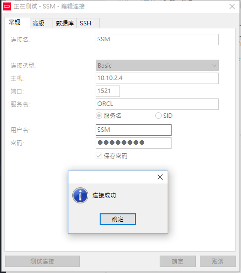
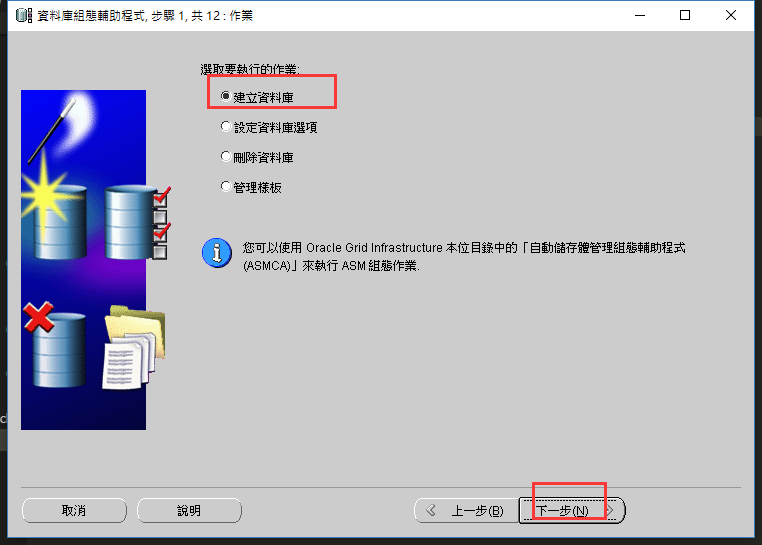
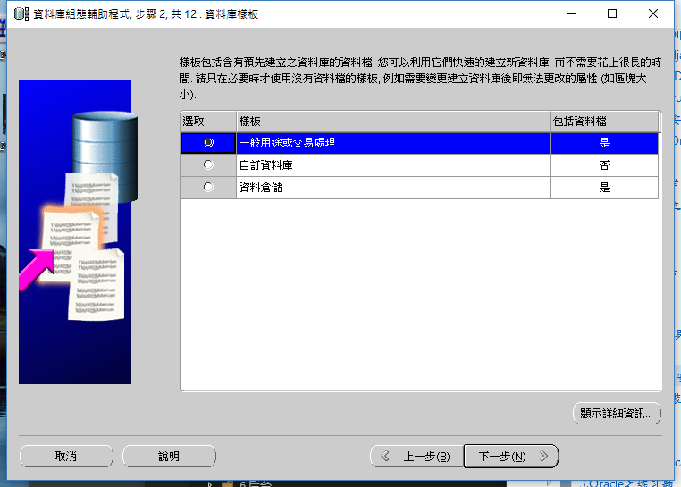
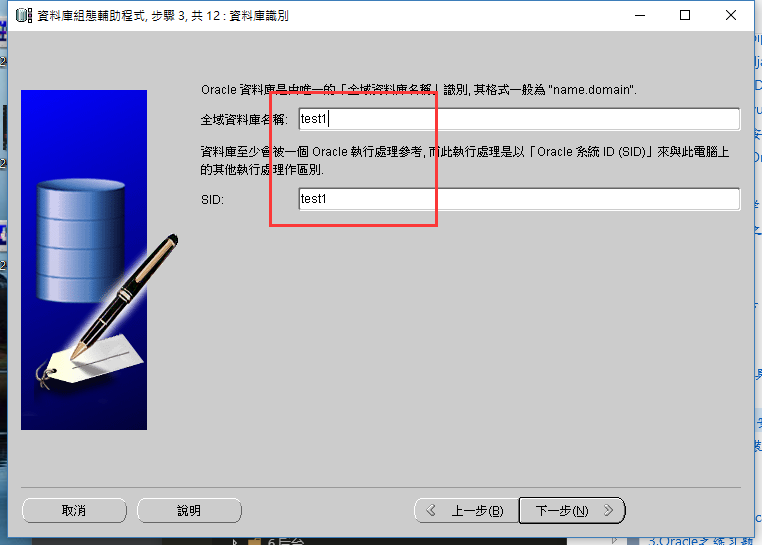
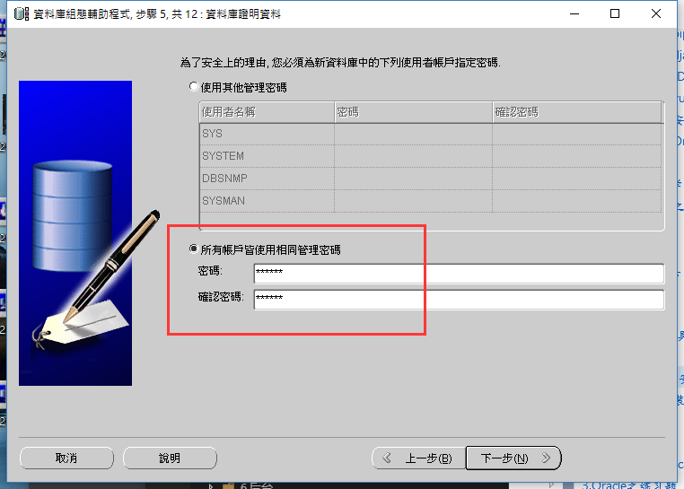
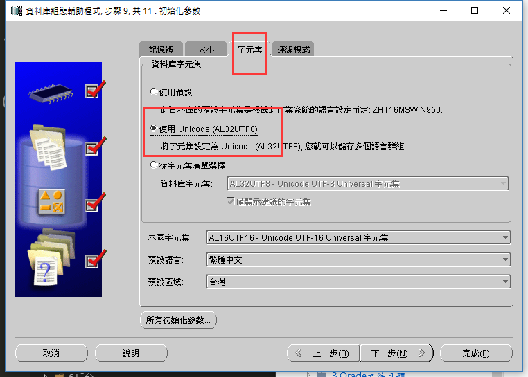
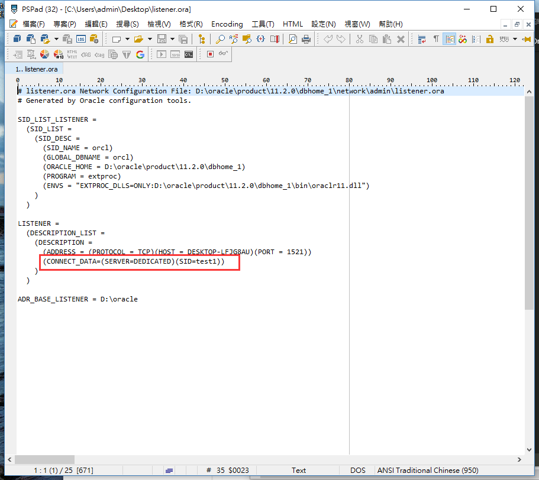
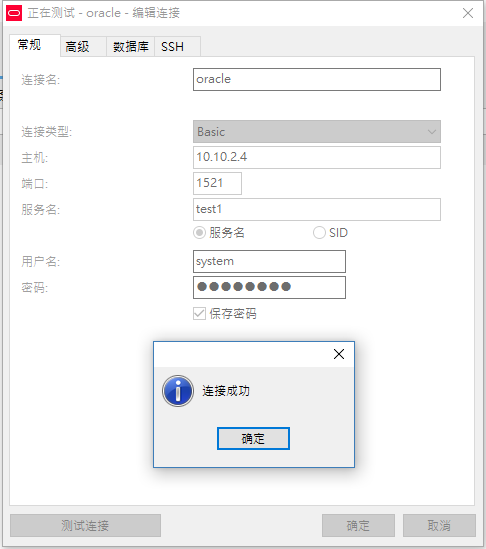

本页目录：

- 1、[创建数据库](#Oracle-01)
- 2、[修改配置文件](#Oracle-02)
- 3、[连接测试](#Oracle-03)


***


# <a name="Oracle-01" href="#" >创建数据库</a>













# <a name="Oracle-02" href="#" >修改配置文件</a>

> 修改listener.ora文件



```
(CONNECT_DATA=(SERVER=DEDICATED)(SID=test1))
```

# <a name="Oracle-03" href="#" >连接测试</a>




