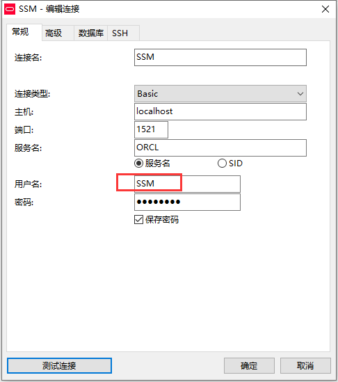

总操作流程：
- 1、创建用户
- 2、创建数据库
- 3、设置监听
- 4、导入数据库

***

# 创建用户

```sql
create user SSM identified by "DKLi123456";

grant  connect,resource,dba,create session,create any table,select any dictionary to SSM;


alter user SSM account unlock;
```

- 测试


# 创建服务名


# 配置监听

> 1、修改配置文件

- listener.ora

```
   (SID_DESC =
      (GLOBAL_DBNAME = SSM)
      (ORACLE_HOME = C:\Software\Oracle\product\11.2.0\dbhome_1)  
      (SID_NAME = SSM)
      (ENVS = "EXTPROC_DLLS=ONLY:C:\Software\Oracle\product\11.2.0\dbhome_1\bin\oraclr11.dll")
    )   
```

```
(ADDRESS = (PROTOCOL = TCP)(HOST = 10.10.2.4)(PORT = 1522))
```



- tnsnames.ora

```
SSM =
  (DESCRIPTION =
    (ADDRESS = (PROTOCOL = TCP)(HOST = 10.10.2.4)(PORT = 1522))
    (CONNECT_DATA =
      (SERVER = DEDICATED)
      (SERVICE_NAME = SSM)
    )
  )
```

```
  (ADDRESS = (PROTOCOL = TCP)(HOST = 10.10.2.4)(PORT = 1522))
```


> 2、界面设置


