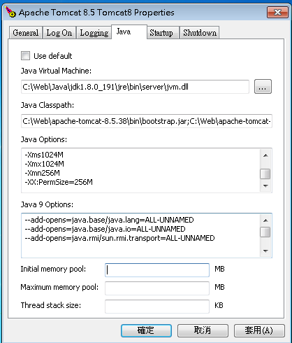

总操作流程：
- 1、添加参数
- 2、测试

***

# 添加参数



```
-Xms1024M
-Xmx1024M
-Xmn256M
-XX:PermSize=256M
-XX:MaxPermSize=256M
-Xss256K
-XX:+DisableExplicitGC
-XX:SurvivorRatio=1
-XX:+UseConcMarkSweepGC
-XX:+UseParNewGC
```