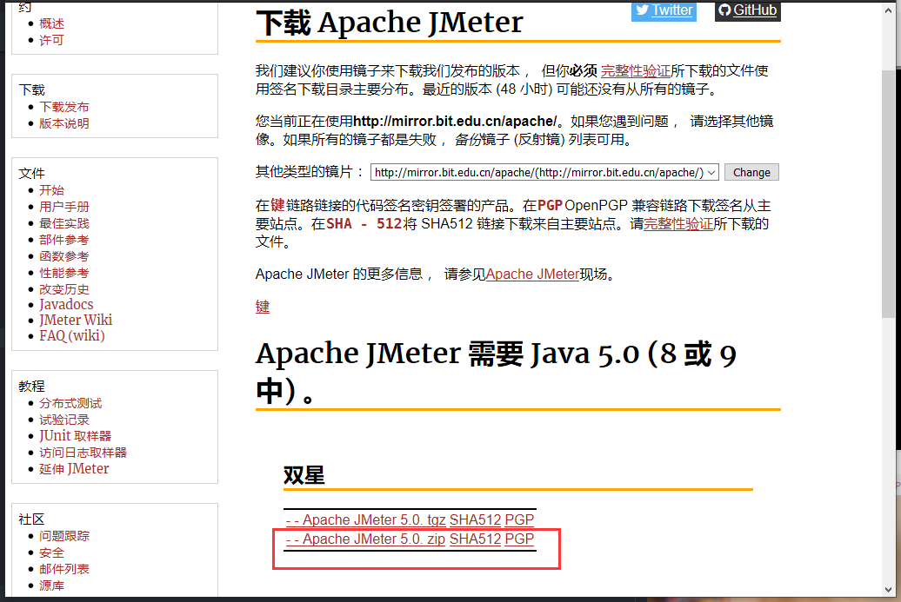

总操作流程：
- 1、[下载安装](#jmeter-01)
- 2、[配置](#jmeter-02)
- 3、[测试](#jmeter-03)

***

# <a name="jmeter-01" href="#" >下载安装</a>


> 1、下载

[](http://jmeter.apache.org/download_jmeter.cgi)



> 2、解压就行

# <a name="jmeter-02" href="#" >配置</a>

```
变量名:JMETER_HOME
变量值:C:\Software\apache-jmeter-5.0


变量名:CLASSPATH
变量值:;%JMETER_HOME%\lib\ext\ApacheJMeter_core.jar;% JMETER_HOME%\lib\jorphan.jar;%JMETER_HOME%\lib\logkit-1.2.jar;

```

# <a name="jmeter-03" href="#" >测试</a>

>进入C:\Software\apache-jmeter-5.0\bin文件夹，执行jmeter.bat

