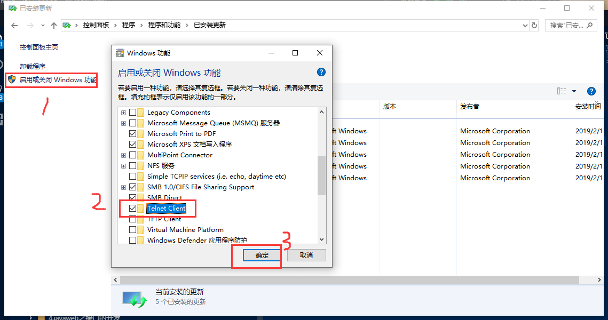

总操作流程：
- 1、[下载安装](#memcached-01)
- 2、[配置](#memcached-02)
- 3、[测试](#memcached-03)

***

# <a name="memcached-01" href="#" >下载安装</a>

> 1、安装telnet



> 2、安装memcached

[](https://pan.baidu.com/s/1O1RVKJHe8jH5k8m0uGDMng)


# <a name="memcached-02" href="#" >配置</a>

- 解压后，cmd管理员进入，命令：schtasks /create /sc onstart /tn memcached /tr "'C:\Software\memcached-amd64\memcached.exe' -m 512 -p 2222"

- 删除命令:schtasks /delete /tn memcached

# <a name="memcached-03" href="#" >测试</a>

```
telnet 10.10.2.4 2222
```
