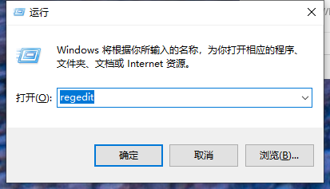
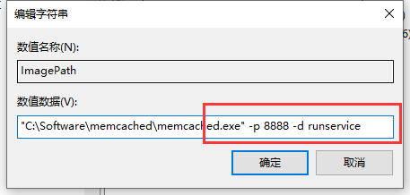

总操作流程：
- 1、[进入注册表](#memcached-01)
- 2、[修改配置文件](#memcached-02)
- 3、[测试](#memcached-03)

***

# <a name="memcached-01" href="#" >进入注册表</a>

>regedit



# <a name="memcached-02" href="#" >修改配置文件</a>

>计算机\HKEY_LOCAL_MACHINE\SYSTEM\CurrentControlSet\Services\memcached



# <a name="memcached-03" href="#" >测试</a>

> cmd输入命令

```
telnet 127.0.0.1 8888
```