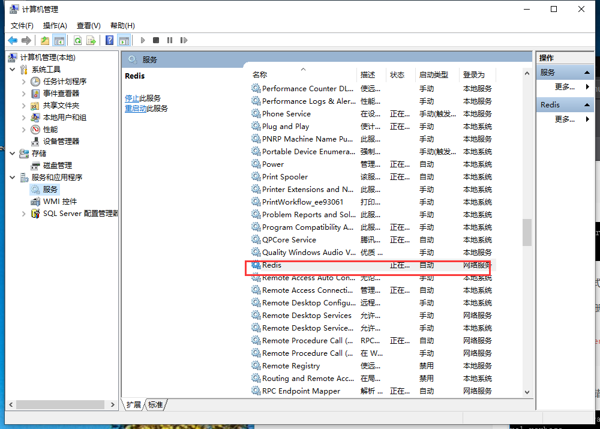

总操作流程：
- 1、下载
- 2、配置
- 3、测试

***

# 1、下载

[](https://github.com/MicrosoftArchive/redis/releases)

# 2、配置

>1、修改redis.windows.conf
```c
daemonize yes

port 6666

timeout 300
```

>2、配置环境变量

```
path后添加：;C:\Software\redis
```

>3、注册redis服务

- 管理员身份运行cmd

```
C:\Software\redis

redis-server --service-install redis.windows.conf --loglevel verbose
 
```

# 3、测试

>cmd中运行

- 1、启动服务



```
cmd命令启动

redis-server --service-start #启动

redis-server --service-stop  #停止
```

- 2、客户端连接（一个cmd窗口）

```
redis-cli.exe -h 127.0.0.1 -p 6666

set myKey abc

get myKey
```