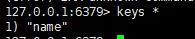
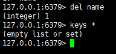

本页目录：
- 1、[存数据](redis-01)
- 2、[取数据](redis-02)
- 3、[查询当前数据所有key](redis-03)
- 4、[删除数据](redis-04)

***

# <a name="redis-01" href="#" >存数据</a>

```
redis-cli  #使用客户端登陆

set name hello
```


# <a name="redis-02" href="#" >取数据</a>

```
get name
```


# <a name="redis-03" href="#" >查询当前数据所有key</a>

```
keys *
```




# <a name="redis-04" href="#" >删除数据</a>


