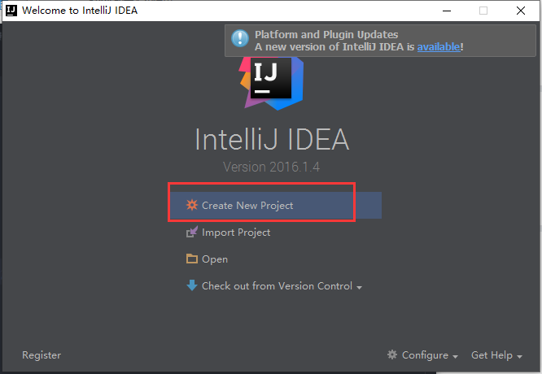
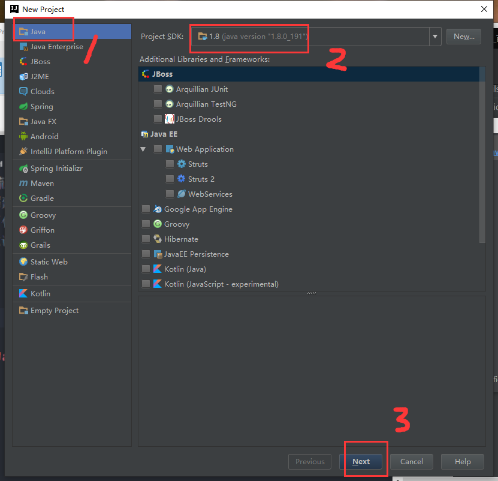
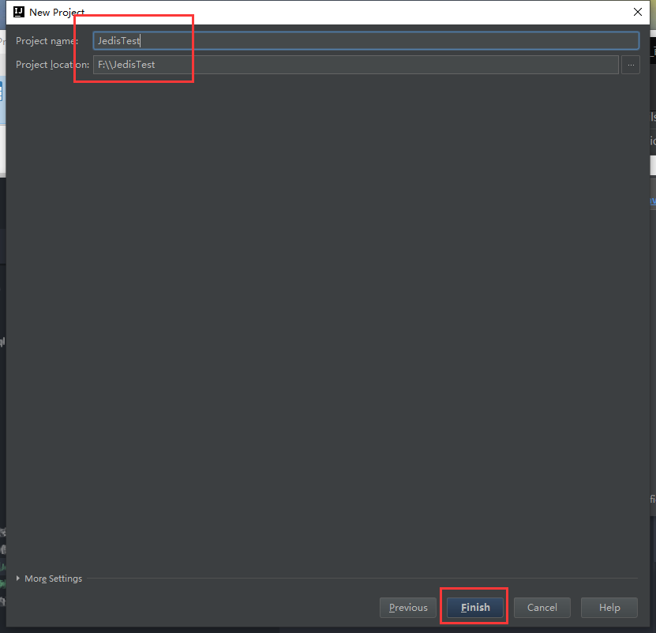
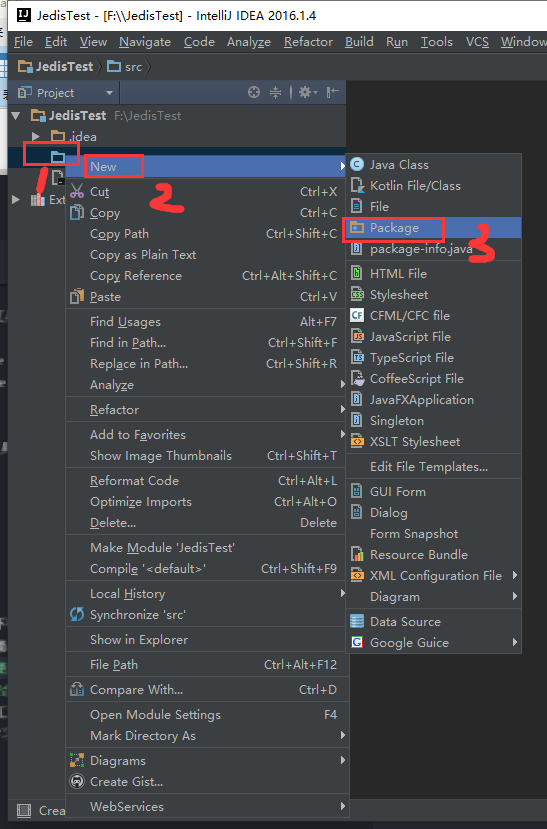
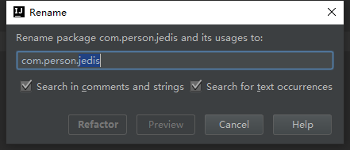
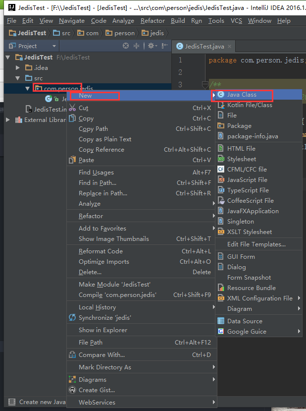
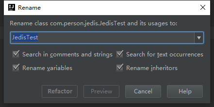
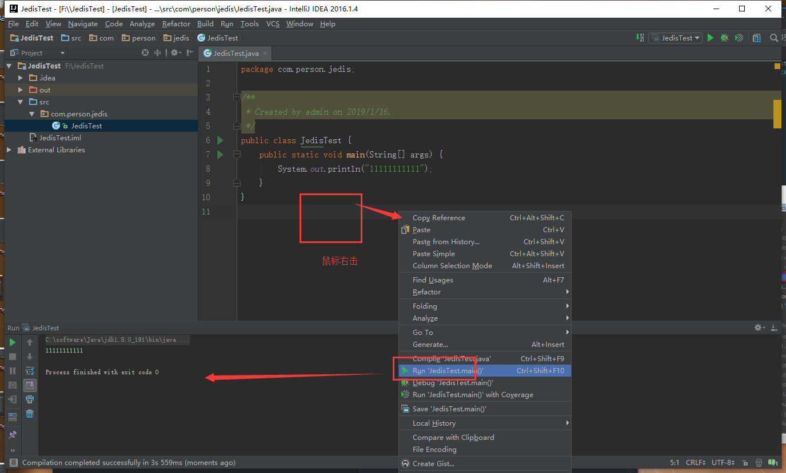
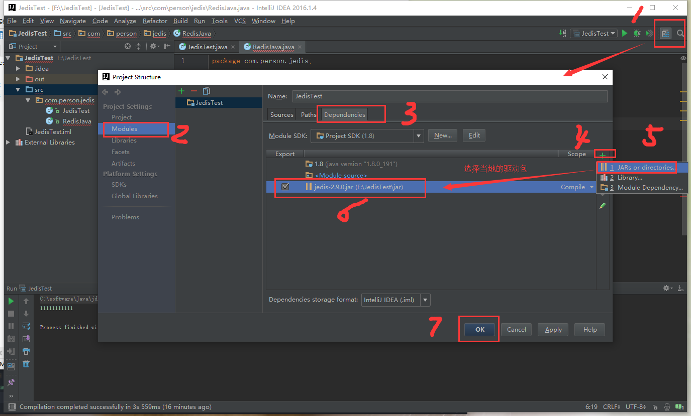

总操作流程：
- 1、创建Java项目
- 2、导入Jedis驱动包
- 3、写Jedis链接redis代码
- 4、测试

***

> 注意：本教程使用idea开发工具操作

# 创建Java项目

>1、创建项目








>2、创建包





>3、创建类





>4、测试

```java
package com.person.jedis;

/**
 * @ClassName: JedisTest
 * @Description: 测试Java项目是否成功
 * @Author : DK_Li
 * @Date: 2019/01/16
 */
public class JedisTest {
    public static void main(String[] args) {
        System.out.println("1111111111");
    }
}

```



# 导入Jedis驱动包

[](https://pan.baidu.com/s/1qfDtD5M3Zinuq5RHP2clAw)



# 写Jedis链接redis代码

```java
package com.person.jedis;

import redis.clients.jedis.Jedis;

/**
 * @ClassName: JedisTest
 * @Description: 连接到 redis 服务
 * @Author : DK_Li
 * @Date: 2019/01/16
 */
public class JedisTest {
    public static void main(String[] args) {
        //连接本地的 Redis 服务
        Jedis jedis = new Jedis("localhost");
        System.out.println("连接成功");
        //查看服务是否运行
        System.out.println("服务正在运行: "+jedis.ping());
    }
}

```


