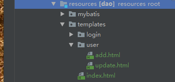

总操作流程：
- 1、[修改pom.xml](springBoot-01)
- 2、[修改application.properties](springBoot-02)
- 3、[写代码](springBoot-03)
- 3、[测试](springBoot-04)

***
- 项目目录结构



# <a name="springBoot-01" href="#" >修改pom.xml</a>
```xml
	<properties>
		<project.build.sourceEncoding>UTF-8</project.build.sourceEncoding>
		<thymeleaf.version>3.0.11.RELEASE</thymeleaf.version>
		<thymeleaf-layout-dialect.version>2.0.0</thymeleaf-layout-dialect.version>
	</properties>
```

```xml
		<!-- thymeleaf的驱动包 -->
		<dependency>
			<groupId>org.springframework.boot</groupId>
			<artifactId>spring-boot-starter-thymeleaf</artifactId>
		</dependency>
```

# <a name="springBoot-02" href="#" >修改application.properties</a>

```js
#thymeleaf
spring.thymeleaf.prefix=classpath:/templates/
spring.thymeleaf.suffix=.html
spring.thymeleaf.mode=HTML5
spring.thymeleaf.encoding=UTF-8
spring.thymeleaf.cache=false
spring.resources.chain.strategy.content.enabled=true
spring.resources.chain.strategy.content.paths=/**
```

# <a name="springBoot-03" href="#" >写代码</a>

> index.html

```html
<!DOCTYPE html>
<html lang="en">
<head>
    <meta charset="UTF-8">
    <title>Title</title>
</head>
<body>

<h2 >拦截测试</h2>
<a href="/user/toAdd">跳转到添加页面</a>
</body>
</html>
```

>add.html

```html
<!DOCTYPE html>
<html lang="en">
<head>
    <meta charset="UTF-8">
    <title>Title</title>
</head>
<body>
<h1>add</h1>
</body>
</html>
```

>UserController

```java
@Controller
@RequestMapping("/user")
public class UserController {

    @RequestMapping("/toIndex")
    public  String toIndex(){
        return "index";
    }

    @RequestMapping("/toAdd")
    public  String toAdd(){
        return "user/add";
    }

}

```
# <a name="springBoot-04" href="#" >测试</a>

运行使用浏览器测试