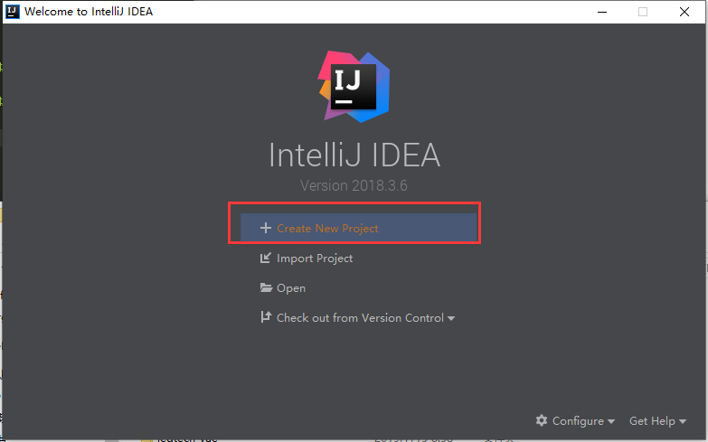
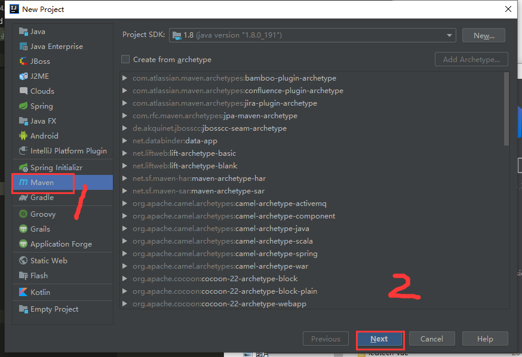
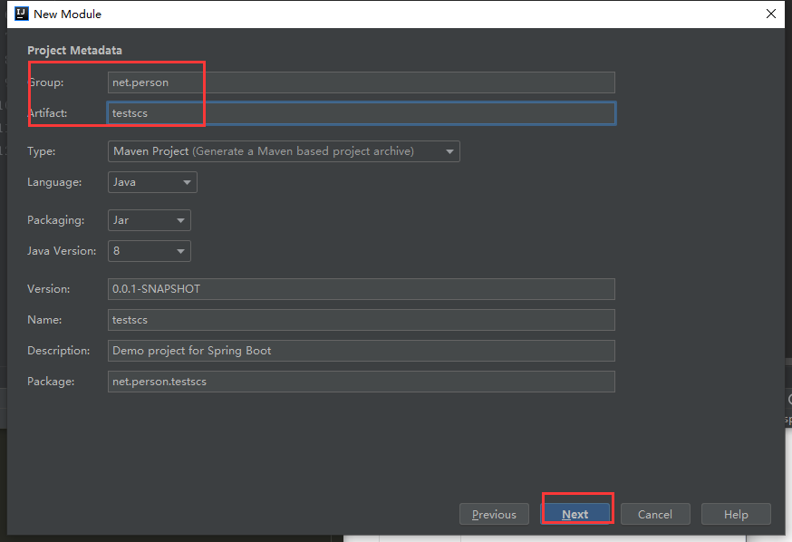
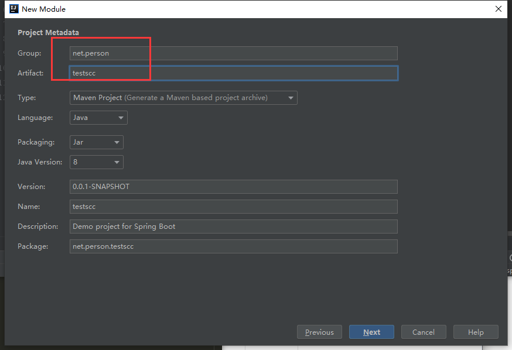
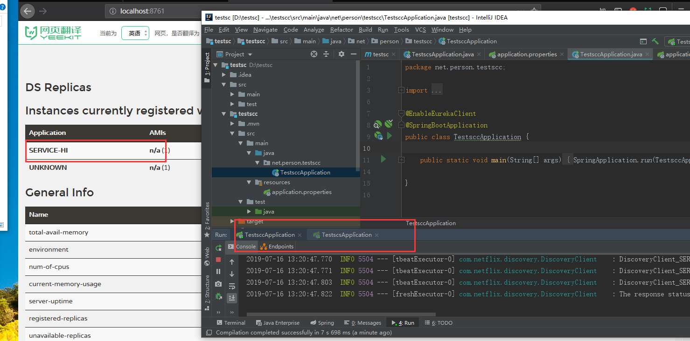

[](https://blog.csdn.net/forezp/column/info/15197/3)

总操作流程：
- 1、创建主maven项目
- 2、创建Eureka Server
- 3、创建Eureka Client
- 4、测试

***
# 创建主maven项目





# 创建Eureka Server子模块





> 在TestscsApplication头加入注解
```java
@EnableEurekaServer
```

> 在application.properties里添加

```js
server.port=8761
eureka.instance.hostname=localhost
eureka.client.registerWithEureka=false
eureka.client.fetchRegistry=false
eureka.client.serviceUrl.defaultZone=http://${eureka.instance.hostname}:${server.port}/eureka/


```

# 创建Eureka Client子模块





> 在TestsccApplication头加入注解
```java
@EnableEurekaClient
```

> 在application.properties里添加

```js
server.port=8762
eureka.client.serviceUrl.defaultZone=http://localhost:8761/eureka/
spring.application.name=service-hi

```

# 测试

运行TestscsApplication和TestscsApplication，浏览器输入：http://localhost:8761

