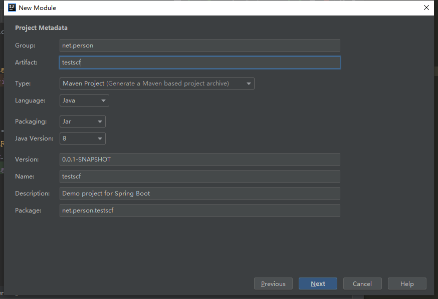
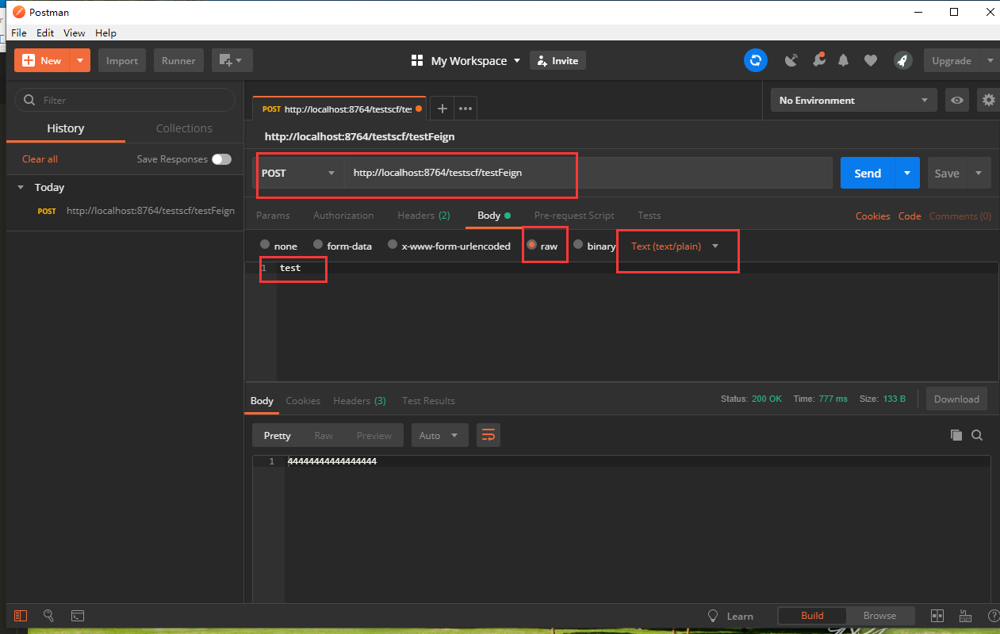

总操作流程：
- 1、[创建多一个Eureka Client](#SpringCloud-01)
- 2、[创建类](#SpringCloud-02)
- 3、[测试](#SpringCloud-03)

***

> 注意该教程基于：1.SpringCloud之项目创建(Eureka)的

# <a name="SpringCloud-01" href="#" >创建多一个Eureka Client</a>





> 在TestscrApplication头加入注解

```java
@EnableDiscoveryClient
@EnableFeignClients
```

> 在application.properties里添加

```js
server.port=8764
eureka.client.serviceUrl.defaultZone=http://localhost:8761/eureka/
spring.application.name=service-feign
```

>在其pom.xml添加驱动

```xml
        <!--spring-cloud-starter-eureka 驱动-->
        <dependency>
            <groupId>org.springframework.cloud</groupId>
            <artifactId>spring-cloud-starter-eureka</artifactId>
        </dependency>
        <!--spring-cloud-starter-feign 驱动-->
        <dependency>
            <groupId>org.springframework.cloud</groupId>
            <artifactId>spring-cloud-starter-feign</artifactId>
        </dependency>
        <dependency>
            <groupId>org.springframework.cloud</groupId>
            <artifactId>spring-cloud-starter-openfeign</artifactId>
        </dependency>
        <!--spring-boot-starter-web 驱动-->
        <dependency>
            <groupId>org.springframework.boot</groupId>
            <artifactId>spring-boot-starter-web</artifactId>
        </dependency>
```


# <a name="SpringCloud-02" href="#" >创建类</a>

> 1、在testscc的模块添加包和类

- net.person.testscc
    - controller
        - HelloControler


`HelloControler`

```java
@RestController
public class HelloControler {

    @RequestMapping(value = "/hi")
    public String hi(@RequestParam String name){
        System.out.println("33333333333333");
        return "44444444444444444";
    }
}
```

> 2、在testscf的模块添加包和类

- net.person.testscf
    - controller
        - FeignController
    - service
        - FeignService

`FeignController`
```java
@RestController
@RequestMapping("/testscf")
public class FeignController {
    private FeignService feignService;

    @Autowired
    public void setFeignService(FeignService feignService) {
        this.feignService = feignService;
    }

    @CrossOrigin
    @PostMapping(path ="/testFeign",produces ={ "text/plain;charset=UTF-8" })
    public String testFeign(@RequestBody String jsonString){
            System.out.println("1111111111111");
            return feignService.testFeign(jsonString);
    }
}
```

`FeignService`
```java
@FeignClient(value = "service-hi")
public interface FeignService {
    @RequestMapping(value = "/hi",method = RequestMethod.GET)
    public String testFeign(@RequestParam(value = "name") String name);
}

```

# <a name="SpringCloud-03" href="#" >测试</a>

运行testscs、testscc、testscf

```js
http://localhost:8764/testscf/testFeign
```


