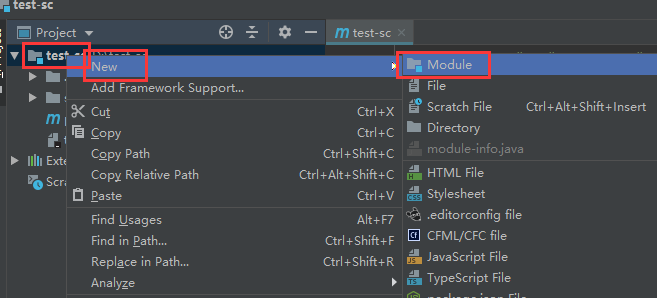
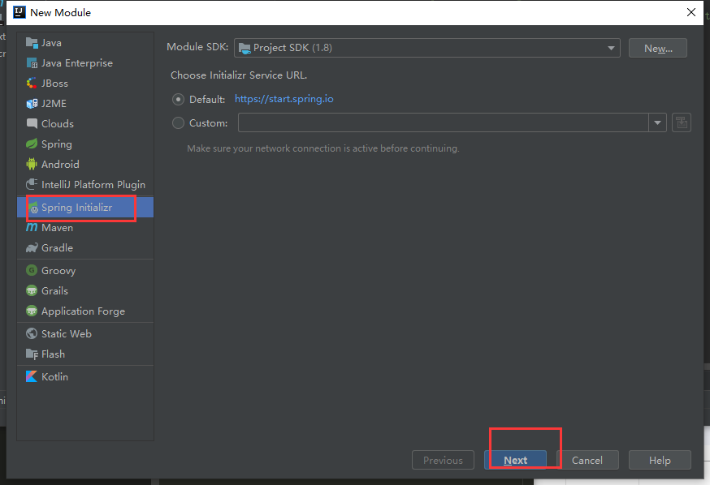
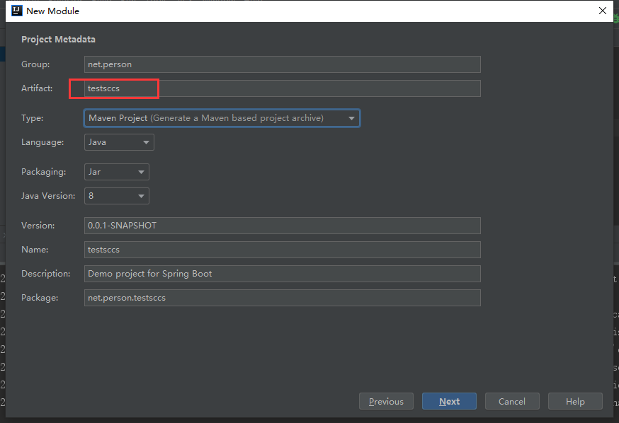
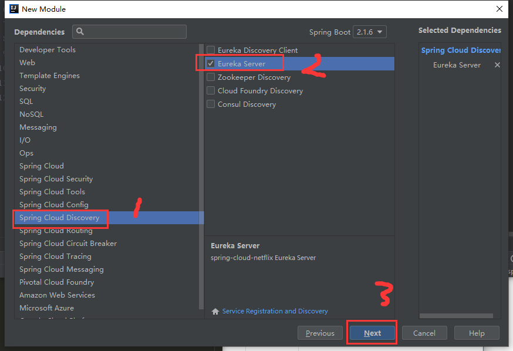
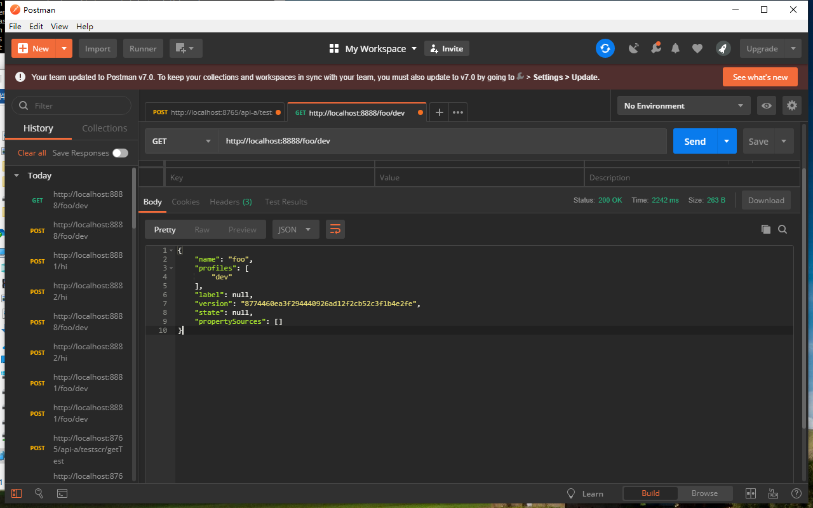
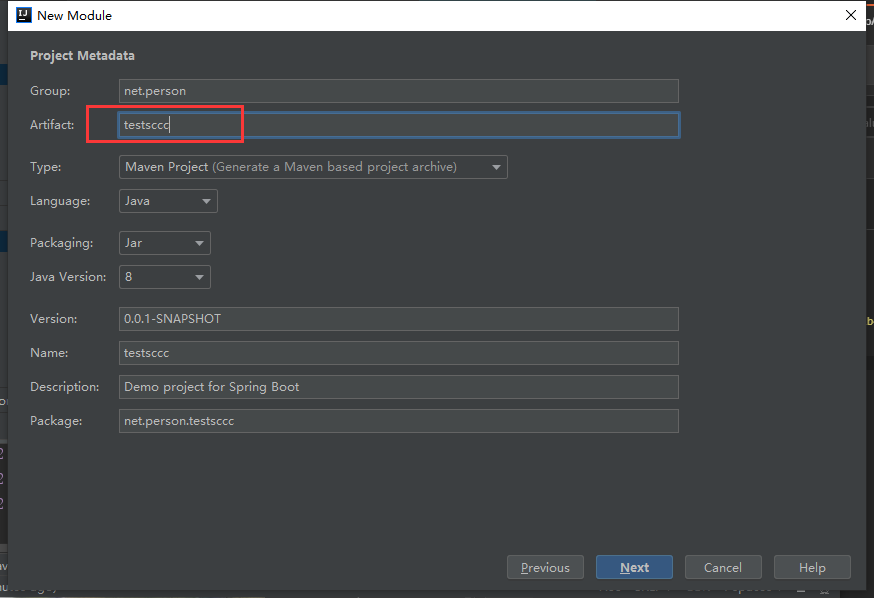
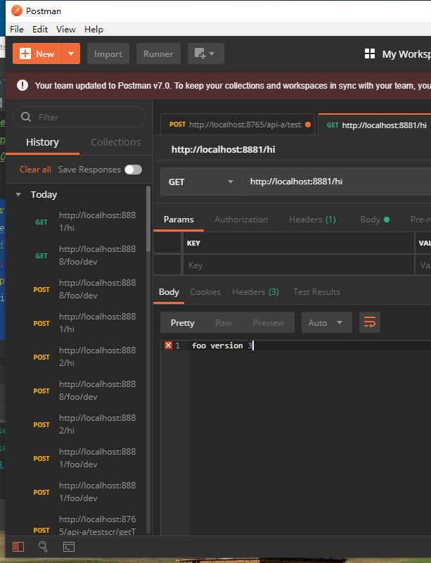

总操作流程:
- 1、github创建仓库
- 2、创建Config Server
- 3、创建config client

***

# github创建仓库

- 1、在github创建SpringcloudConfig仓库
- 2、在仓库创建config-client-dev.properties文件，内容是：

```shell
foo = foo version 3
```

# 创建Config Server

> 1、创建testsccs









>2、pom.xml修改

- 导入驱动包

```xml
        <!--spring-cloud-starter-eureka 驱动-->
        <dependency>
            <groupId>org.springframework.cloud</groupId>
            <artifactId>spring-cloud-starter-eureka</artifactId>
        </dependency>

        <!-- springCloudConfig 配置中心 驱动-->
        <dependency>
            <groupId>org.springframework.cloud</groupId>
            <artifactId>spring-cloud-config-server</artifactId>
            <version>2.0.0.RC1</version>
        </dependency>

```

- 加入配置

```xml
 <repositories>
        <repository>
            <id>spring-milestones</id>
            <name>Spring Milestones</name>
            <url>https://repo.spring.io/milestone</url>
            <snapshots>
                <enabled>false</enabled>
            </snapshots>
        </repository>
    </repositories>
```

> 3、在TestsccsApplication加入注解

```java
@EnableConfigServer
```

> 4、application.properties添加内容

```js
spring.application.name=config-server
server.port=8888
spring.cloud.config.server.git.uri=这里写github的http地址
eureka.client.register-with-eureka=false
eureka.client.fetch-registry=false
spring.cloud.config.server.git.searchPaths=respo
spring.cloud.config.label=master
spring.cloud.config.server.git.username=这里写用户名
spring.cloud.config.server.git.password=这里写密码

```

> 5、运行测试

```js
http://localhost:8888/foo/dev
```



# 创建config client


> 1、创建testsccs





>2、pom.xml修改

- 1、加入驱动包

```xml
        <!--spring-cloud-starter-config 驱动-->
        <dependency>
            <groupId>org.springframework.cloud</groupId>
            <artifactId>spring-cloud-starter-config</artifactId>
        </dependency>

        <!--spring-boot-starter-web 驱动-->
        <dependency>
            <groupId>org.springframework.boot</groupId>
            <artifactId>spring-boot-starter-web</artifactId>
        </dependency>
```

- 2、加入配置

```xml

<repositories>
        <repository>
            <id>spring-milestones</id>
            <name>Spring Milestones</name>
            <url>https://repo.spring.io/milestone</url>
            <snapshots>
                <enabled>false</enabled>
            </snapshots>
        </repository>
</repositories>

```

> 3、在包net.person.testsccc.controller，创建TestscccController类

```java
@RestController
public class TestscccController {
    @Value("${foo}")
    String foo;
    @RequestMapping(value = "/hi")
    public String hi(){
        return foo;
    }
}
```

> 4、运行测试

```js
http://localhost:8881/hi
```



