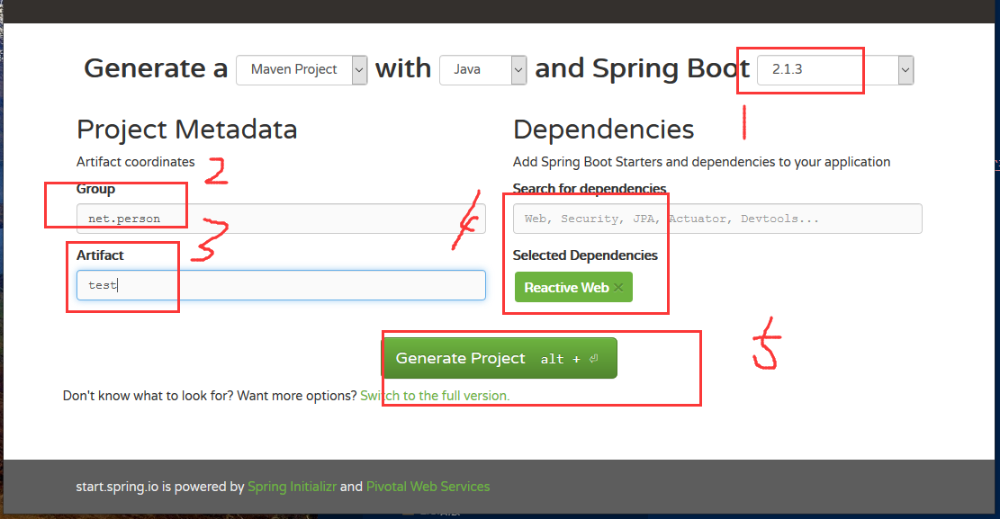
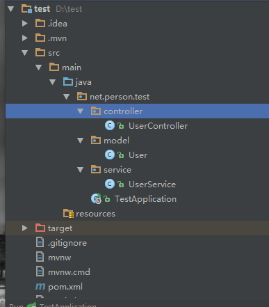
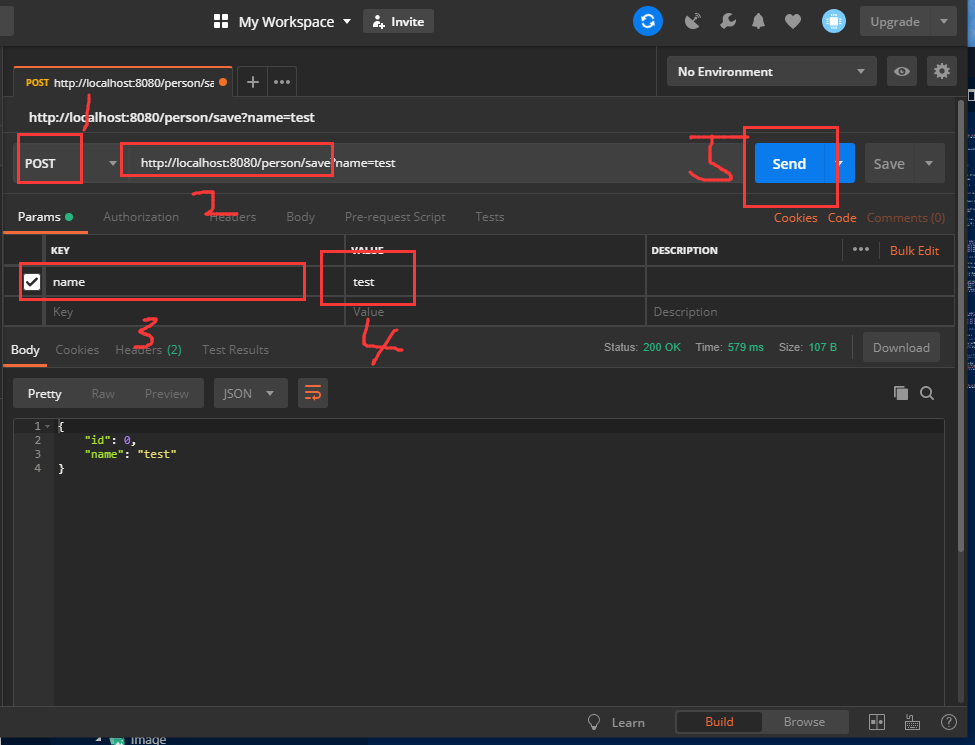

总操作流程：
- 1、下载导入
- 2、写程序
- 3、测试

***

# 下载导入

> 1、下载

[](https://start.spring.io/)



> 2、导入

- 解压后，使用idea导入maven项目的方式导入

# 写程序

- 项目目录结构



> 1、创建model
```java
public class User {
    public int id;
    public String name;

    public User() {
    }

    public User(int id, String name) {
        this.id = id;
        this.name = name;
    }

    public int getId() {
        return id;
    }

    public void setId(int id) {
        this.id = id;
    }

    public String getName() {
        return name;
    }

    public void setName(String name) {
        this.name = name;
    }

    @Override
    public String toString() {
        return "User{" +
                "id=" + id +
                ", name='" + name + '\'' +
                '}';
    }
}
```

> 2、创建Controller
```java
import net.person.test.model.User;
import net.person.test.service.UserService;
import org.springframework.beans.factory.annotation.Autowired;
import org.springframework.web.bind.annotation.PostMapping;
import org.springframework.web.bind.annotation.RequestParam;
import org.springframework.web.bind.annotation.RestController;

/**
 * Created by admin on 2019/2/28.
 */
@RestController
public class UserController {

    private final UserService userService;

    @Autowired
    public UserController(UserService userService) {
        this.userService = userService;
    }

    @PostMapping("/person/save")
    public User save(@RequestParam String name){
        User user=new User();
        user.setName(name);
        if (userService.save(user)){
            System.out.println("用户对象：%s 保存成功！\n"+user);
        }
        return user;
    }
}

```

> 3、创建sevice

```java
import net.person.test.model.User;
import org.springframework.stereotype.Repository;

import java.util.concurrent.ConcurrentHashMap;
import java.util.concurrent.ConcurrentMap;
import java.util.concurrent.atomic.AtomicInteger;

/**
 * Created by admin on 2019/2/28.
 */
@Repository
public class UserService {
    /**
     * 采用内存型的存储方式->Map
     */
    private final ConcurrentMap<Integer,User> repository=new ConcurrentHashMap<>();
    private  final static AtomicInteger idCenerator=new AtomicInteger();
    /**
     * 保存用户对象
     * @param {@link User} 对象
     * @return 如果保存成功，返回<code>true</code>,否则，返回<code>false</code>
     */
    public boolean save(User user) {
        boolean success=false;
        Integer id=idCenerator.incrementAndGet();
        user.setId(id);
        return  repository.put(id,user)==null;
    }
}

```

# 测试

运行springboot

[](https://www.getpostman.com/)P


