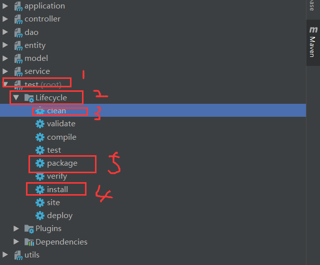
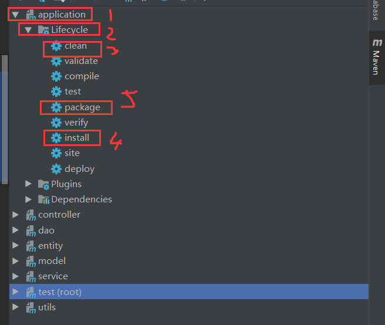

总操作流程：
- 1、创建项目
- 2、源码
- 3、测试

***

> 目录结构



>修改Application文件设置成tomcat的方式运行
```java
@SpringBootApplication
public class SsmApplication extends SpringBootServletInitializer {
	protected SpringApplicationBuilder configure(SpringApplicationBuilder builder) {
		return builder.sources(SsmApplication.class);
	}
	public static void main(String[] args) {
		SpringApplication.run(SsmApplication.class, args);
	}

}
```

# 创建项目




# 源码

[](https://github.com/lidekai/springboot-ssm.git)

# 测试

>部署到tomcat用运行，连接用

```
http://localhost:8089/test/getData
```

>idea运行用
```
http://localhost:8089/ssm_war_exploded/test/getData
```