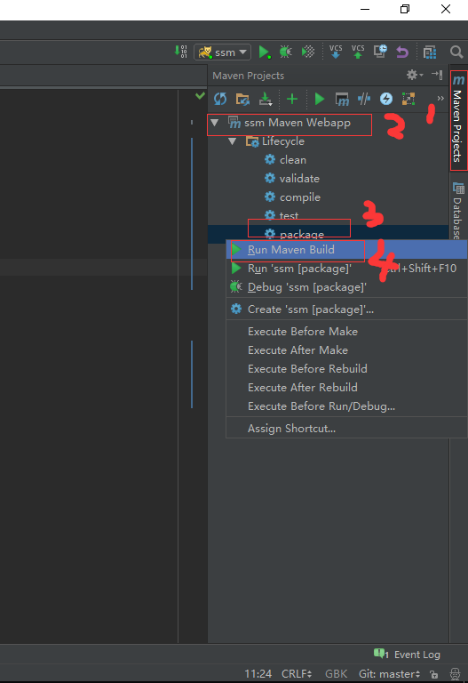
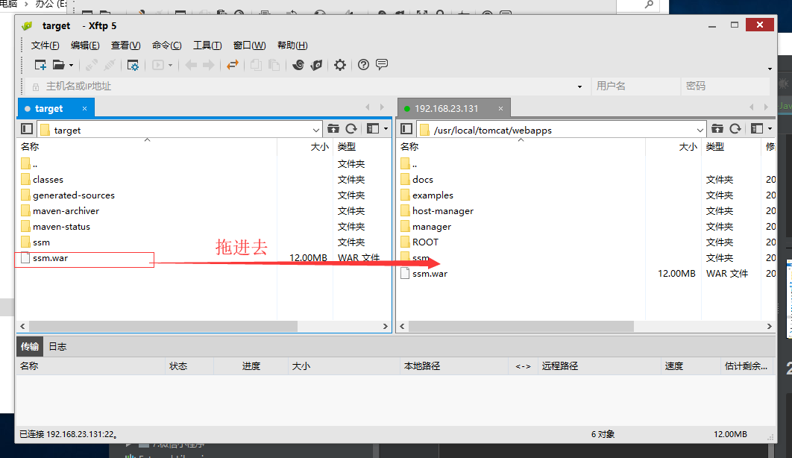

操作总流程：
- 1、安装运行环境；
- 2、修改文件；
- 3、打包,上传项目；

----------

# 确认linux下环境
### 1、mysql
[mysql的安装](https://github.com/OurNotes/CCN/blob/master/4.%E6%9C%8D%E5%8A%A1%E5%99%A8/1.linux/2.linux%E4%B9%8B%E5%AE%89%E8%A3%85%E8%BD%AF%E4%BB%B6/8-Linux%E4%B9%8B%E7%A6%BB%E7%BA%BF%E5%AE%89%E8%A3%85MySql.md)

[mysql的远程连接](https://github.com/OurNotes/CCN/blob/master/5.%E6%95%B0%E6%8D%AE%E5%BA%93/2.%E6%95%B0%E6%8D%AE%E5%BA%93%E4%B9%8B%E5%AD%A6%E4%B9%A0/1.Navicat%20Premium%E8%BF%9E%E6%8E%A5%E8%99%9A%E6%8B%9F%E6%9C%BA%E7%9A%84mysql.md)

### 2、tomcat
[tomcat的安装](https://github.com/OurNotes/CCN/blob/master/4.%E6%9C%8D%E5%8A%A1%E5%99%A8/3.tomcat/1.tomcat%E4%B9%8B%E5%AD%A6%E4%B9%A0/1-tomcat%E4%B9%8B%E5%AE%89%E8%A3%85%E9%85%8D%E7%BD%AE.md)

[tomcat的本地浏览](https://github.com/OurNotes/CCN/blob/master/4.%E6%9C%8D%E5%8A%A1%E5%99%A8/3.tomcat/1.tomcat%E4%B9%8B%E5%AD%A6%E4%B9%A0/2-tomcat%E4%B9%8B%E6%9C%AC%E5%9C%B0%E6%B5%8F%E8%A7%88%E5%99%A8%E8%AE%BF%E9%97%AE.md)

# 修改文件
### 1、修改项目的jdbc.properties文件
```
#本地数据库
#db.url=jdbc:mysql://localhost:3306/ssm?characterEncoding=utf-8
#db.username=root
#db.password=123456

#服务器数据库
db.url=jdbc:mysql://192.168.23.131:3307/ssm?characterEncoding=utf-8&useSSL=false
db.username=dk
db.password=DKLi123456!
```
### 2、修改linux的tomcat的配置文件
```
cd /usr/local/tomcat/conf #进入配置文件的文件夹

vi server.xml #编辑文件

```

`在<host></host>里添加内容`
```
<Context path="/" docBase="项目名字.war" debug="0" privileged="true" reloadable="true"/>
```

重启tomcat
```
/usr/local/tomcat/bin/shutdown.sh

/usr/local/tomcat/bin/startup.sh
```
# 打包,上传项目
### 1、打包maven项目





### 2、上传项目
```
chmod 0777 /usr/local/tomcat/webapps #给文件写入权限

```

