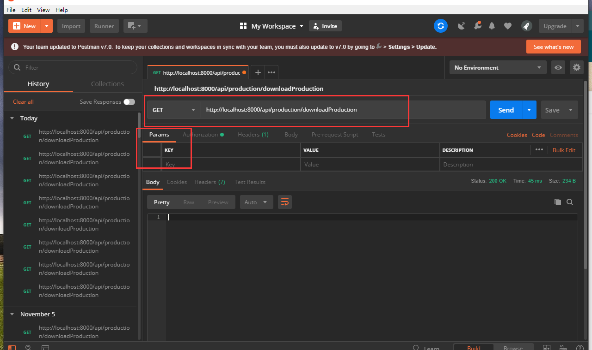
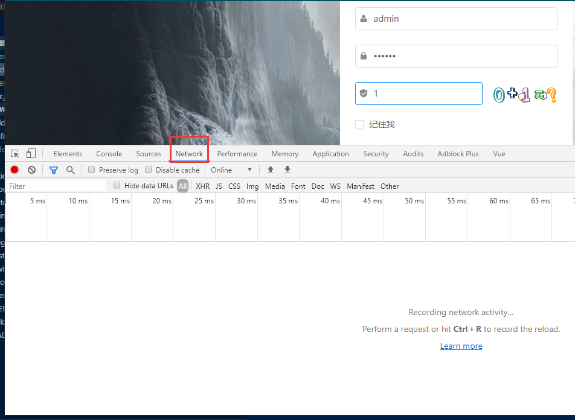

总操作流程:
- 1、[不需要token认证](#eladmin-01) 
    - 1.1、[改代码](#eladmin-01-01) 
    - 1.2、[使用postman测试](#eladmin-01-02) 
    - 1.3、[看效果](#eladmin-01-03) 
- 2、[需要token认证](#eladmin-02) 
    - 2.1、[获取登录的token](#eladmin-02-01) 
    - 2.2、[使用postman测试](#eladmin-02-02) 
    - 2.3、[看效果](#eladmin-02-03) 

`注意：要是不需要token认证，测试接口，这一步不需要运行eladmin-web，可以的话eladmin由后台负责人开发，eladmin-web交给前端负责人开发`

***

# <a name="eladmin-01" href="#" >不需要token的</a>
### <a name="eladmin-01-01" href="#" >改代码</a>

> 改了ProductionController的要测试的接口注解
```java
	@Log("查询生产进度")
    @ApiOperation("查询生产进度")
    @GetMapping(value = "/downloadProduction")
	//@PreAuthorize("@el.check('production:list')")
	@AnonymousAccess
    public void getProductionList(){
		System.out.println("111111111111111111111111111");
	}
```

### <a name="eladmin-01-02" href="#" >使用postman测试</a>


### <a name="eladmin-01-03" href="#" >看效果</a>

> postman发送后sts的控制台可以看到有输出

# <a name="eladmin-02" href="#" >需要token的</a>

### <a name="eladmin-02-01" href="#" >获取登录的token</a>

> 回到登录页面，按快捷键<kbd>F12</kbd>进入调试模式



> 登录后


### <a name="eladmin-02-02" href="#" >使用postman测试</a>

[](https://www.getpostman.com/)


### <a name="eladmin-02-03" href="#" >看效果</a>

> postman发送后sts的控制台可以看到有输出


