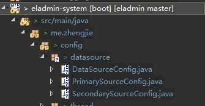
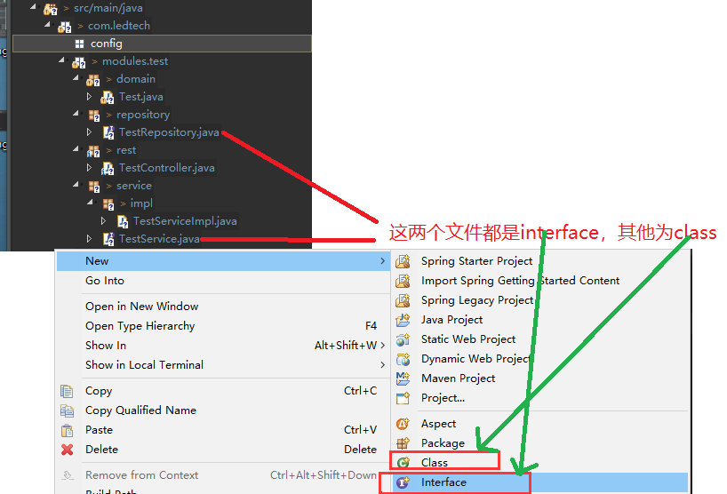
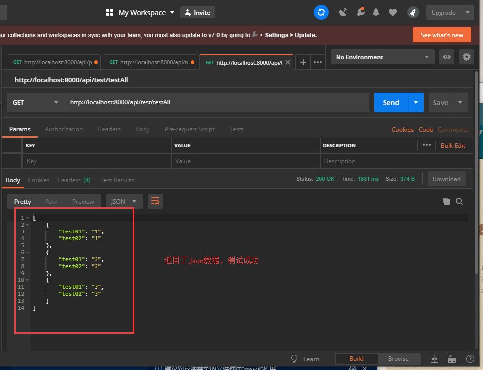

总操作流程：
- 1、[修改数据库配置文件](#eladmin-01)
- 2、[写连接多个数据库的代码](#eladmin-02)
- 3、[写测试代码](#eladmin-03)
- 4、[测试](#eladmin-04)

***

# <a name="eladmin-01" href="#" >修改数据库配置文件</a>

> application-dev.yml (这个配置是在windos下起作用)

```shell
#配置数据源
spring:
  datasource:
     primary:
        driverClassName: net.sf.log4jdbc.sql.jdbcapi.DriverSpy
        jdbc-url: jdbc:log4jdbc:mysql://localhost:3306/eladmin?serverTimezone=Asia/Shanghai&characterEncoding=utf8&useSSL=false
        username: root
        password: 123456
        type: com.alibaba.druid.pool.DruidDataSource
        # 初始化配置
        initial-size: 3
        # 最小连接数
        min-idle: 3
        # 最大连接数
        max-active: 15
        # 获取连接超时时间
        max-wait: 5000
        # 连接有效性检测时间
        time-between-eviction-runs-millis: 90000
        # 最大空闲时间
        min-evictable-idle-time-millis: 1800000
        test-while-idle: true
        test-on-borrow: false
        test-on-return: false
        validation-query: select 1
        # 配置监控统计拦截的filters
        filters: stat
        stat-view-servlet:
          url-pattern: /druid/*
          reset-enable: false
        web-stat-filter:
          url-pattern: /*
          exclusions: "*.js,*.gif,*.jpg,*.bmp,*.png,*.css,*.ico,/druid/*"

     secondary:
        driverClassName: oracle.jdbc.OracleDriver
        jdbc-url: jdbc:oracle:thin:@localhost:1521:ORCL
        username: SSM
        password: 123456
        type: com.alibaba.druid.pool.DruidDataSource
        # 初始化配置
        initial-size: 3
        # 最小连接数
        min-idle: 3
        # 最大连接数
        max-active: 15
        # 获取连接超时时间
        max-wait: 5000
        # 连接有效性检测时间
        time-between-eviction-runs-millis: 90000
        # 最大空闲时间
        min-evictable-idle-time-millis: 1800000
        test-while-idle: true
        test-on-borrow: false
        test-on-return: false
        validation-query: select 1
        # 配置监控统计拦截的filters
        filters: stat
        stat-view-servlet:
          url-pattern: /druid/*
          reset-enable: false
        web-stat-filter:
          url-pattern: /*
          exclusions: "*.js,*.gif,*.jpg,*.bmp,*.png,*.css,*.ico,/druid/*"

  #配置 Jpa
  jpa:
    hibernate:
      # 生产环境设置成 none，避免程序运行时自动更新数据库结构
      ddl-auto: update

#jwt
jwt:
  header: Authorization
  secret: mySecret
  # token 过期时间/毫秒，6小时  1小时 = 3600000 毫秒
  expiration: 21600000
  # 在线用户key
  online: online-token
  # 验证码
  codeKey: code-key

#是否允许生成代码，生产环境设置为false
generator:
  enabled: true

#是否开启 swagger-ui
swagger:
  enabled: true

# 文件存储路径
file:
  path: C:\eladmin\file\
  avatar: C:\eladmin\avatar\
  # 文件大小 /M
  maxSize: 100
  avatarMaxSize: 5
```

> application-prod.yml(该文件，在liux环境下起作用)

```shell
#配置数据源
spring:
  datasource:
     primary:
        driverClassName: net.sf.log4jdbc.sql.jdbcapi.DriverSpy
        jdbc-url: jdbc:log4jdbc:mysql://localhost:3306/eladmin?serverTimezone=Asia/Shanghai&characterEncoding=utf8&useSSL=false
        username: root
        password: 123456
        type: com.alibaba.druid.pool.DruidDataSource
        # 初始化配置
        initial-size: 3
        # 最小连接数
        min-idle: 3
        # 最大连接数
        max-active: 15
        # 获取连接超时时间
        max-wait: 5000
        # 连接有效性检测时间
        time-between-eviction-runs-millis: 90000
        # 最大空闲时间
        min-evictable-idle-time-millis: 1800000
        test-while-idle: true
        test-on-borrow: false
        test-on-return: false
        validation-query: select 1
        # 配置监控统计拦截的filters
        filters: stat

        stat-view-servlet:
          url-pattern: /druid/*
          reset-enable: false
          login-username: admin
          login-password: 123456

        web-stat-filter:
          url-pattern: /*
          exclusions: "*.js,*.gif,*.jpg,*.bmp,*.png,*.css,*.ico,/druid/*"

     secondary:
        driverClassName: oracle.jdbc.OracleDriver
        jdbc-url: jdbc:oracle:thin:@localhost:1521:ORCL
        username: SSM
        password: 123456
        type: com.alibaba.druid.pool.DruidDataSource
        # 初始化配置
        initial-size: 3
        # 最小连接数
        min-idle: 3
        # 最大连接数
        max-active: 15
        # 获取连接超时时间
        max-wait: 5000
        # 连接有效性检测时间
        time-between-eviction-runs-millis: 90000
        # 最大空闲时间
        min-evictable-idle-time-millis: 1800000
        test-while-idle: true
        test-on-borrow: false
        test-on-return: false
        validation-query: select 1
        # 配置监控统计拦截的filters
        filters: stat

        stat-view-servlet:
          url-pattern: /druid/*
          reset-enable: false
          login-username: admin
          login-password: 123456

        web-stat-filter:
          url-pattern: /*
          exclusions: "*.js,*.gif,*.jpg,*.bmp,*.png,*.css,*.ico,/druid/*"

      
  #配置 Jpa
  jpa:
    hibernate:
      # 生产环境设置成 none，避免程序运行时自动更新数据库结构
      ddl-auto: none

#jwt
jwt:
  header: Authorization
  secret: mySecret
  # token 过期时间 2个小时
  expiration: 7200000
  # 在线用户key
  online: online-token
  # 验证码
  codeKey: code-key

#是否允许生成代码，生产环境设置为false
generator:
  enabled: false

#如果生产环境要开启swagger，需要配置请求地址
#springfox:
#  documentation:
#    swagger:
#      v2:
#        host: # 接口域名或外网ip

#是否开启 swagger-ui
swagger:
  enabled: false

# 文件存储路径
file:
  path: /home/eladmin/file/
  avatar: /home/eladmin/avatar/
  # 文件大小 /M
  maxSize: 100
  avatarMaxSize: 5
```

# <a name="eladmin-02" href="#" >写连接多个数据库的代码</a>



> DataSourceConfig

```java
/***
 ** 配置多数据源
 * @author DK_Li
 *
 */
@Configuration
public class DataSourceConfig {
	    
	    @Bean(name = "primaryDataSource")
	    @Qualifier("primaryDataSource")
	    @Primary
	    @ConfigurationProperties(prefix = "spring.datasource.primary")
	    public DataSource masterDataSource() {
	        return DataSourceBuilder.create().build();
	    }

	    @Bean(name = "secondaryDataSource")
	    @Qualifier("secondaryDataSource")
	    @ConfigurationProperties(prefix="spring.datasource.secondary")
	    public DataSource secondaryDataSource() {
	        return DataSourceBuilder.create().build();
	    }
}

```

> PrimarySourceConfig

```java
/***
**配置主数据的属性
 * @author DK_Li
 *
 */
@Configuration
@EnableTransactionManagement
@EnableJpaRepositories(
        entityManagerFactoryRef = "entityManagerFactoryPrimary",
        transactionManagerRef = "transactionManagerPrimary",
        basePackages = {"me.zhengjie.*"}
)
public class PrimarySourceConfig {
	@Autowired
    @Qualifier("primaryDataSource")
    private DataSource primaryDataSource;

    @Primary
    @Bean(name = "entityManagerPrimary")
    public EntityManager entityManager(EntityManagerFactoryBuilder builder) {
        return entityManagerFactoryPrimary(builder).getObject().createEntityManager();
    }

    @Resource
    private Properties jpaProperties;

    @Primary
    @Bean(name = "entityManagerFactoryPrimary")
    public LocalContainerEntityManagerFactoryBean entityManagerFactoryPrimary(EntityManagerFactoryBuilder builder) {
        LocalContainerEntityManagerFactoryBean entityManagerFactory = builder
                .dataSource(primaryDataSource)
                .packages("me.zhengjie.*") //设置实体类所在位置
                .persistenceUnit("primaryPersistenceUnit")
                .build();
        entityManagerFactory.setJpaProperties(jpaProperties);
        return entityManagerFactory;
    }

    @Primary
    @Bean(name = "transactionManagerPrimary")
    public PlatformTransactionManager transactionManagerPrimary(EntityManagerFactoryBuilder builder) {
        return new JpaTransactionManager(entityManagerFactoryPrimary(builder).getObject());
    }
}

```

> SecondarySourceConfig

```java
/***
**配置从数据的属性
 * @author DK_Li
 *
 */
@Configuration
@EnableTransactionManagement
@EnableJpaRepositories(
        entityManagerFactoryRef="entityManagerFactorySecondary",
        transactionManagerRef="transactionManagerSecondary",
        basePackages= { "com.ledtech.*" }) //设置Repository所在位置
public class SecondarySourceConfig {

    @Autowired
    @Qualifier("secondaryDataSource")
    private DataSource secondaryDataSource;

    @Bean(name = "entityManagerSecondary")
    public EntityManager entityManager(EntityManagerFactoryBuilder builder) {
        return entityManagerFactorySecondary(builder).getObject().createEntityManager();
    }

    @Resource
    private Properties jpaProperties;

    @Bean(name = "entityManagerFactorySecondary")
    public LocalContainerEntityManagerFactoryBean entityManagerFactorySecondary (EntityManagerFactoryBuilder builder) {
        LocalContainerEntityManagerFactoryBean entityManagerFactory = builder
                .dataSource(secondaryDataSource)
                .packages("com.ledtech.*") //设置实体类所在位置
                .persistenceUnit("secondaryPersistenceUnit")
                .build();
        entityManagerFactory.setJpaProperties(jpaProperties);
        return entityManagerFactory;
    }


    @Bean(name = "transactionManagerSecondary")
    PlatformTransactionManager transactionManagerSecondary(EntityManagerFactoryBuilder builder) {
        return new JpaTransactionManager(entityManagerFactorySecondary(builder).getObject());
    }

}
```


# <a name="eladmin-03" href="#" >写测试代码</a>



> Test

```java
/***
**测试的实体类。将数据库获取的数据显示到视图层
 * @author DK_Li
 *
 */
@Entity
@Getter
@Setter
@Table(name="TEST",schema = "SSM")
public class Test implements Serializable{
	@Id
    @GeneratedValue(strategy = GenerationType.IDENTITY)
    @NotNull(groups = Update.class)
    private String test01;
	
	@NotBlank
    @Column(unique = true)
    private String test02;
	
	public @interface Update {}
}

```

> TestController

```java
/***
**测试的控制层
 * @author DK_Li
 *
 */
@Api(tags = "测试")
@RestController
@RequestMapping("/api/test")
@SuppressWarnings("unused")
public class TestController {
	
	private final TestService testService;
	
	public TestController(TestService testService) {
		this.testService=testService;
	}

	
	@Log("测试")
    @ApiOperation("查询测试")
    @GetMapping(value = "/test")
	@AnonymousAccess
    public void getTest(){
		System.out.println("00000000000");
	}
	
	@SuppressWarnings("rawtypes")
	@Log("测试")
    @ApiOperation("查询测试")
    @GetMapping(value = "/testAll")
	@AnonymousAccess
    public ResponseEntity getTestList(){
		System.out.println("55555555");
		return new ResponseEntity<>(testService.findAll(),HttpStatus.OK);
	}
}
```

> TestService

```java
/***
**测试的服务层的接口
 * @author DK_Li
 *
 */
public interface TestService {
	List<Test> findAll();
}

```

> TestServiceImpl

```java
/***
**测试的服务层的实现类
 * @author DK_Li
 *
 */
@Service
@CacheConfig(cacheNames = "test")
@Transactional(propagation = Propagation.SUPPORTS, readOnly = true, rollbackFor = Exception.class)
public class TestServiceImpl implements TestService{
	
	private final TestRepository testRepository;
	
	public TestServiceImpl(TestRepository testRepository) {
		this.testRepository=testRepository;
	}

	@Override
	public List<Test> findAll() {
		return testRepository.findAll();
	}

}

```

> TestRepository

```java
/***
**测试的数据层
 * @author DK_Li
 *
 */
public interface TestRepository extends JpaRepository<Test, Long>, JpaSpecificationExecutor<Test>{
	List<Test> findAll();
}
```

> oracle的数据

```sql
DROP TABLE "SSM"."TEST";
CREATE TABLE "SSM"."TEST" (
  "TEST01" VARCHAR2(255 BYTE) NOT NULL ,
  "TEST02" VARCHAR2(255 BYTE) 
)
ALTER TABLE "SSM"."TEST" ADD CONSTRAINT "key_TEST_TEST01" PRIMARY KEY ("TEST01");

INSERT INTO "SSM"."TEST" VALUES ('1', '1');
INSERT INTO "SSM"."TEST" VALUES ('2', '2');
INSERT INTO "SSM"."TEST" VALUES ('3', '3');

```

# <a name="eladmin-04" href="#" >测试</a>

> 使用postman测试




- 注意：后台的接口开发可以模范eladmin-system模块中的user相关的代码