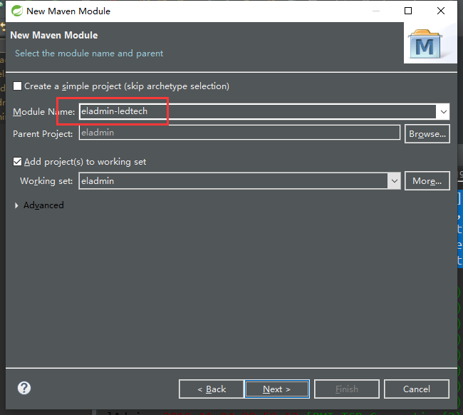
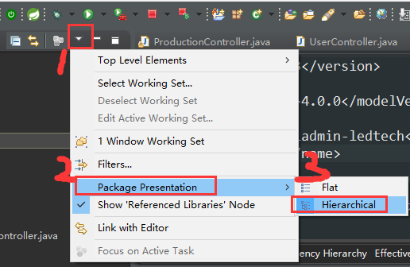
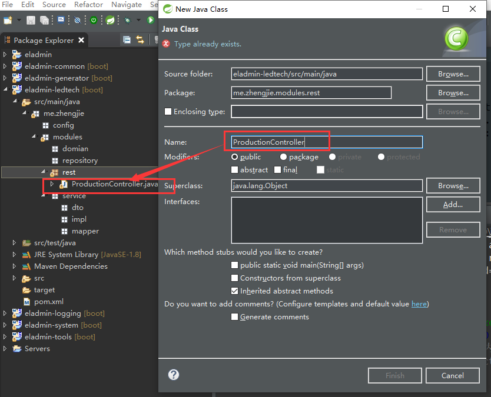
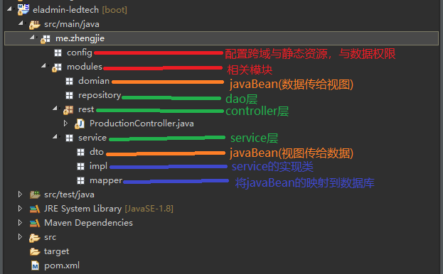
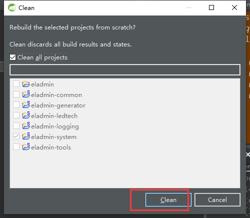
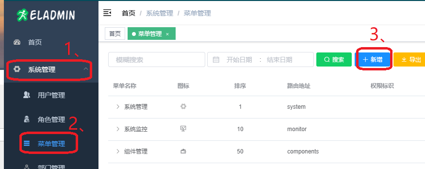
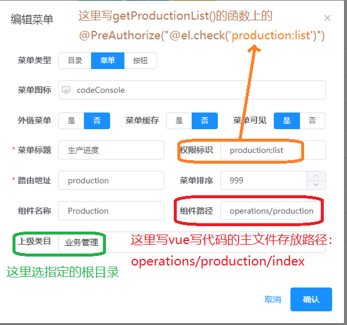
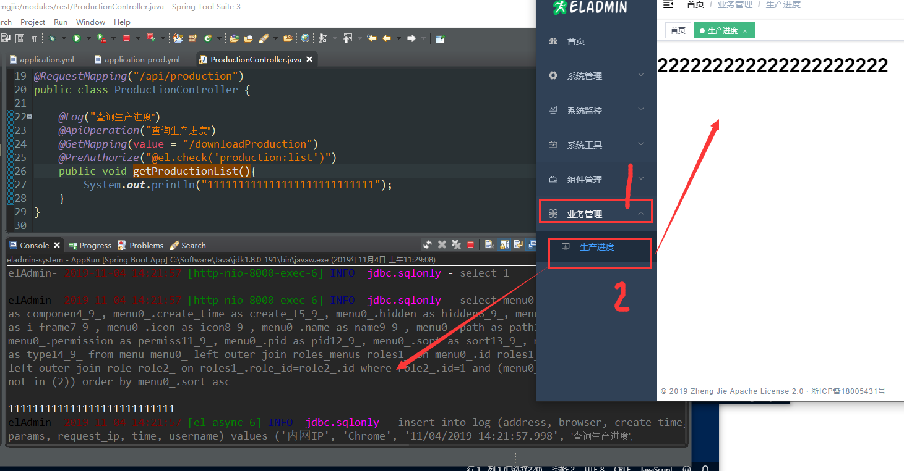

总操作流程：
- 1、[eladmin](#eladmin-01) 
    - 1.1、[新建子模块](#eladmin-01-01) 
    - 1.2、[写代码](#eladmin-01-04) 
    - 1.3、[运行](#eladmin-01-03) 
- 2、[eladmin-web](#eladmin-02) 
    - 2.1、[新建子模块](#eladmin-02-01) 
    - 2.2、[写代码](#eladmin-02-02) 
    - 2.3、[看效果](#eladmin-02-03) 

***

# <a name="eladmin-01" href="#" >eladmin</a>
### <a name="eladmin-01-01" href="#" >新建子模块</a>

File > New > Other... > Maven > Maven Module (然后点击Next)




### <a name="eladmin-01-02" href="#" >写修改</a>

> eladmin-system的pom.xml引用eladmin-ledtech

```xml
        <dependency>
            <groupId>me.zhengjie</groupId>
            <artifactId>eladmin-tools</artifactId>
            <version>2.3</version>
        </dependency>
        
        <dependency>
            <groupId>me.zhengjie</groupId>
            <artifactId>eladmin-ledtech</artifactId>
            <version>2.3</version>
        </dependency>

```

> eladmin-ledtech的pom.xml全部换成以下的

```xml
<?xml version="1.0"?>
<project xmlns="http://maven.apache.org/POM/4.0.0"
         xmlns:xsi="http://www.w3.org/2001/XMLSchema-instance"
         xsi:schemaLocation="http://maven.apache.org/POM/4.0.0 http://maven.apache.org/xsd/maven-4.0.0.xsd">
  
  <parent>
    <groupId>me.zhengjie</groupId>
    <artifactId>eladmin</artifactId>
    <version>2.3</version>
  </parent>
  <modelVersion>4.0.0</modelVersion>
  
  <artifactId>eladmin-ledtech</artifactId>
  <name>业务模块</name>
  
  <properties>
    <project.build.sourceEncoding>UTF-8</project.build.sourceEncoding>
  </properties>
  
  <dependencies>
        <!-- 同时需要common模块和logging模块只需要引入logging模块即可 -->
        <dependency>
            <groupId>me.zhengjie</groupId>
            <artifactId>eladmin-logging</artifactId>
            <version>2.3</version>
        </dependency>
  </dependencies>
  
</project>

```

> 建包和class文件


- 1、将包转成树形结构展现




- 2、建立包（测试的话直接建立一个包就行：me.zhengjie.modules.rest）

右键eladmin-ledtech/src/main/java的me.zhengjie包 > New > Package


- 3、建class文件（测试的话直接建立一个包就行：ProductionController）

右键eladmin-ledtech/src/main/java的me.zhengjie.modules.rest包 > New > Class



```java
package me.zhengjie.modules.rest;

import org.springframework.security.access.prepost.PreAuthorize;
import org.springframework.web.bind.annotation.GetMapping;
import org.springframework.web.bind.annotation.PostMapping;
import org.springframework.web.bind.annotation.RequestMapping;
import org.springframework.web.bind.annotation.RestController;

import io.swagger.annotations.Api;
import io.swagger.annotations.ApiOperation;
import me.zhengjie.aop.log.Log;

/**
 * @author DK_Li
 * @date 2019-11-04
 */
@Api(tags = "业务模块：生产进度")
@RestController
@RequestMapping("/api/production")
public class ProductionController {
	
	@Log("查询生产进度")
    @ApiOperation("查询生产进度")
    @GetMapping(value = "/downloadProduction")
	@PreAuthorize("@el.check('production:list')")
    public void getProductionList(){
		System.out.println("111111111111111111111111111");
	}
}

```

- 4、以包作为class文件的分类，解说



### <a name="eladmin-01-03" href="#" >运行</a>

- 1、清理

Project > Clean...



- 2、maven编译项目

```
compile
```


- 3、运行


# <a name="eladmin-02" href="#" >eladmin-web</a>

`eladmin-web要运行，再进行下面的`

### <a name="eladmin-02-01" href="#" >新建子模块</a>

> 新建菜单






> 给admin账号菜单权限


- 按快捷键：<kbd>F5</kbd> 刷新浏览器

> 创建子模块(在\src\views文件夹下)

- operations
    - production


### <a name="eladmin-02-02" href="#" >写代码</a>

> 创建index.vue

```html
<template>
  <div>
    <h1>222222222222222222222</h1>
  </div>
</template>

<script>
import { downloadProduction } from '@/api/production'
export default {
  name: 'Production',
  data() {
    return {}
  },
  mounted: function() {
    downloadProduction(this.params).then(result => {
      this.downloadLoading = false
    }).catch(() => {
      this.downloadLoading = false
    })
  }
}
</script>

<style scoped>
</style>

```

> 创建production.js

- 路径在src/api文件夹下

```js
import request from '@/utils/request'

export function downloadProduction(params) {
  return request({
    url: 'api/production/downloadProduction',
    method: 'get',
    params,
    responseType: 'blob'
  })
}
```

> 按快捷键保存代码：Ctrl+S，浏览器自动刷新

### <a name="eladmin-02-03" href="#" >看效果</a>

