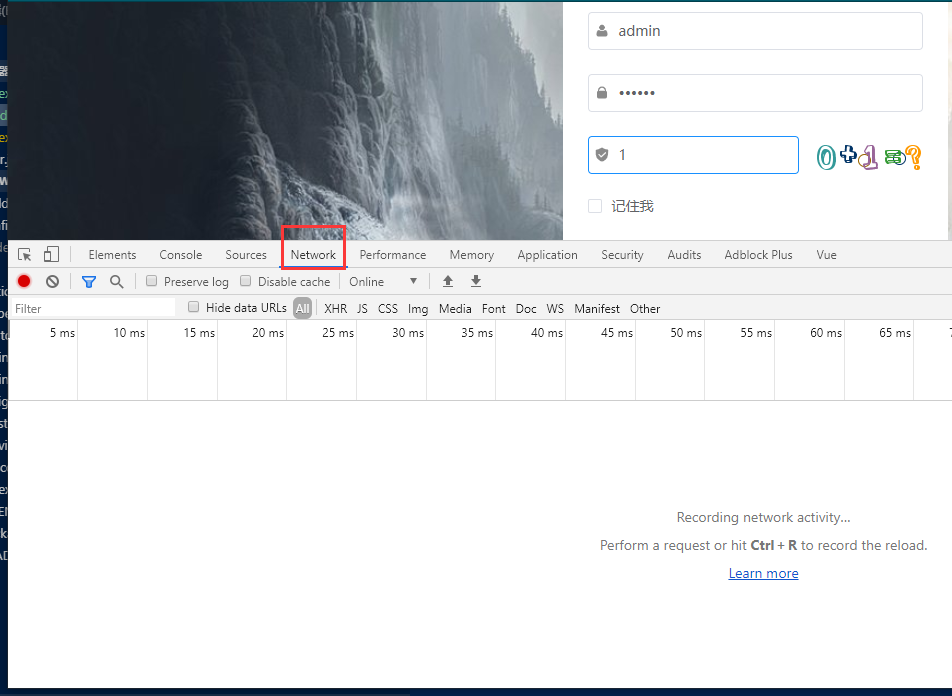
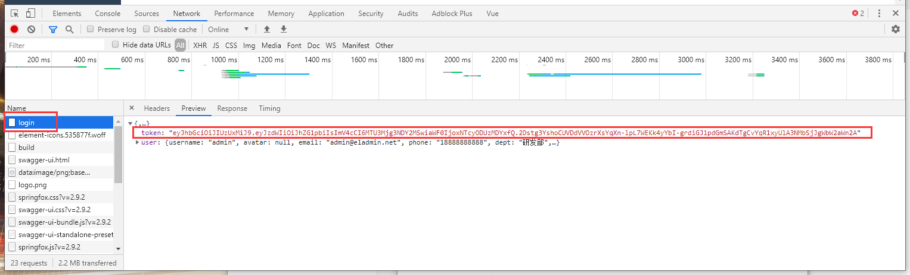
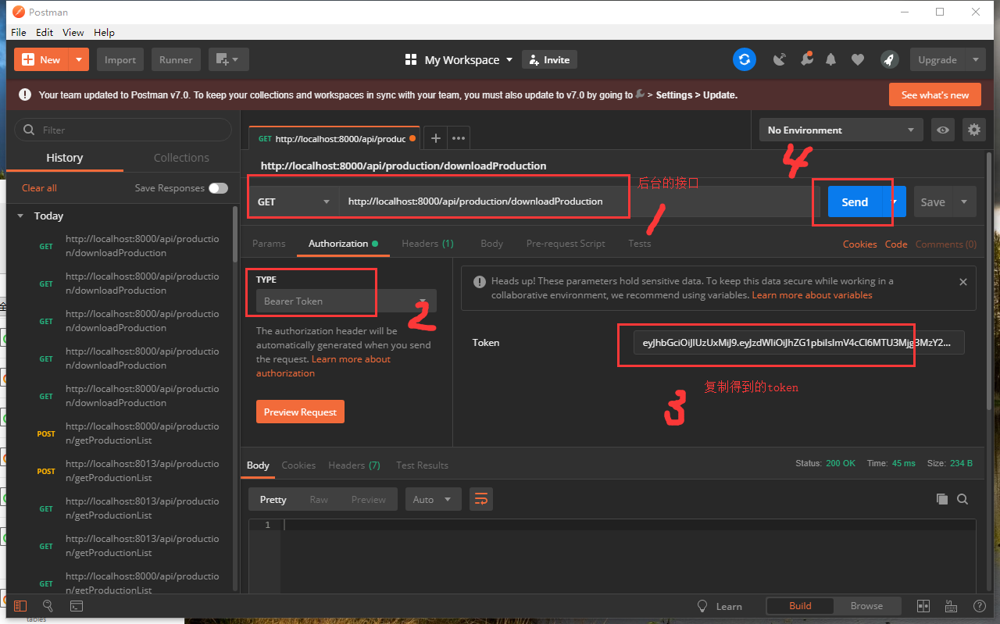

总操作流程:
- 1、[获取登录的token](#eladmin-01) 
- 2、[使用postman测试](#eladmin-02) 
- 3、[看效果](#eladmin-03) 

***

# <a name="eladmin-01" href="#" >获取登录的token</a>

> 回到登录页面，按快捷键<kbd>F12</kbd>进入调试模式

> 登录后

# <a name="eladmin-02" href="#" >使用postman测试</a>

# <a name="eladmin-03" href="#" >看效果</a>

> postman发送后sts的控制台可以看到有输出

