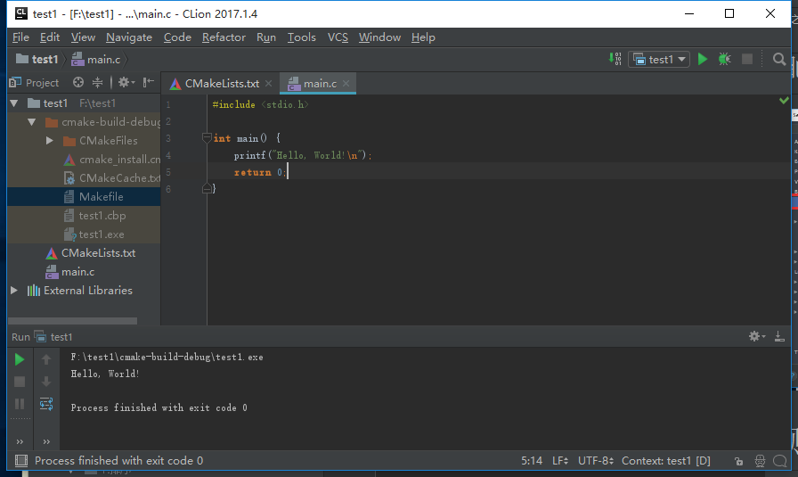

总操作流程：
- 1、下载安装；
- 2、配置编译环境;
- 3、测试；


***

# 下载安装
[](https://www.jetbrains.com/clion/download/previous.html)


- 破解：
在激活界面的License server输入：`http://idea.wrbugtest.tk/`

```
File -> settings -> Plugins 即可调出设置中的插件选项。
```
- 参考：

[](https://www.zhihu.com/question/22437385)


# 配置编译环境


# 测试

创建一个c项目，运行


