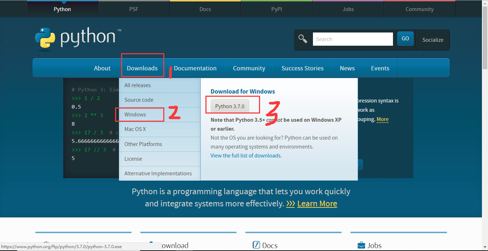

总操作流程：
- 1、下载安装；
- 2、配置环境；
- 3、测试；

***

# 下载安装

[](https://www.python.org/)



# 配置环境
- 添加:
```
变量名：PYTHON_HOME
变量值：C:\SoftwareDevelopmentTools\python-3.7.0
```
- path后添加
```
;%PYTHON_HOME%
```

# 测试
- cmd下输入命令：
```shell
Python
```
- 成功标志：


