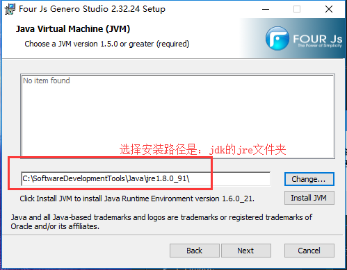

總操作流程：
- 1、[下載安裝](#gbl-01)
- 2、[配置gdc](#gbl-02)
- 3、[測試](#gbl-03)

***

# <a name="gbl-01" href="#" >下載安裝</a>

- 下载安装jdk

- 下载安装gdc

`我是选：fjs-gdc-2.40.16-build4635.58-w32vc90进行安装的`

- 下载安装GeneroStudio

# <a name="gbl-02" href="#" >配置gdc</a>

- 设置界面

右击快捷打开》选择属性

- 链接erp

