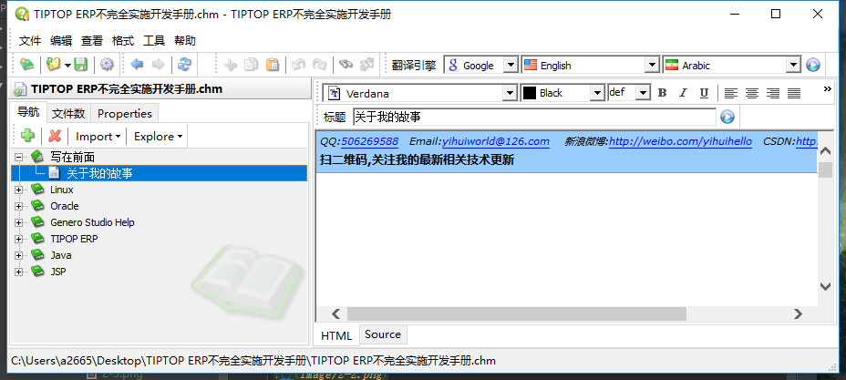

总操作流程：
- 1、[下载资料](#gbl-01)
- 2、[方法一](#gbl-02)
    - 2-[1、配置](#gbl-02-01)
    - 2-[2、看效果](#gbl-02-02)
- 3、[方法二](#gbl-03)
    - 3-[1、修改文件名](#gbl-03-01)
    - 3-[2、看效果](#gbl-03-02)

***

#  <a name="gbl-01" href="#" >下载资料</a>

# <a name="gbl-02" href="#" >方法一</a>

### <a name="gbl-02-01" href="#" >配置</a>

- 解压文件

解压文件TIPTOP ERP不完全实施开发手册.zip的文件和其文件夹下的CHM Editor.rar文件

- 运行文件

`1.运行CHM Editor夹下的chmeditor_cr1.exe文件`

`2.选择 TIPTOP ERP不完全实施开发手册.chm 文件`

`3.修改后记得保存设置：crtl+s`

### <a name="gbl-02-02" href="#" >看效果</a>

# <a name="gbl-03" href="#" >方法二</a>

### <a name="gbl-03-01" href="#" >修改文件名</a>

解藥后直接將.chm文件的名字重新命名為英文的。

### <a name="gbl-03-02" href="#" >看效果</a>

`直接點擊`

