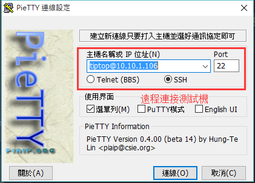
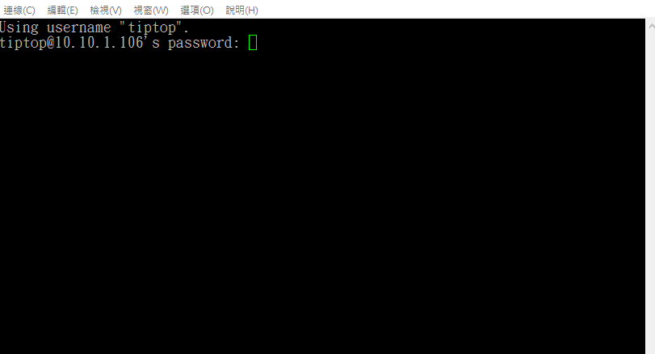

總操作流：
- 1、[下載安裝](#gbl-01)
- 2、[配置](#gbl-02)
- 3、[測試](#gbl-03)

***

#  <a name="gbl-01" href="#" >下載安裝</a>

[](https://pan.baidu.com/s/1Zh2SmCSamdwBqemShYmIWg)

# <a name="gbl-02" href="#" >配置</a>



# <a name="gbl-03" href="#" >測試</a>

```
密碼：tiptop
```

